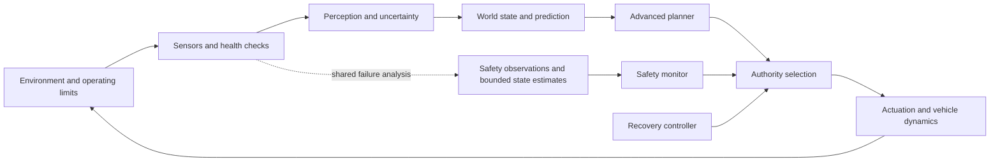

# Proposed assurance architecture: from road to air

Status: project design hypothesis, not an approved vehicle design. [C-015]

The recurring example starts with a car approaching a partially obscured conflict. The vehicle then becomes airborne and encounters another aircraft. Hold the conceptual chain constant and make every changed assumption explicit.

The shared learned task is a **vision cue**, not a direct maneuver command: a calibrated camera sequence produces a candidate object or unexpected region, image location/bearing, timestamp and uncertainty/unknown state. The road and air cases share this interface, but use separate frozen releases, datasets and tests. Tracking, range/rate or other geometry, planning, monitoring and recovery remain explicit system obligations. AMLAS v1.1 informs the data/learning/verification part of this chain; a component result alone cannot discharge the road or air action claim. [C-TRAIN-001] [C-TRAIN-002] [C-TRAIN-003]

The separate safety-observation box represents an obligation to demonstrate an adequate observation path. It does not assert that redundant sensors are independent, or that such a path is feasible in every encounter. A monitor using only the same missed-object output as the planner can share the failure. [C-016]

## Evidence obligations

| ID | Obligation | Concrete review object |
|---|---|---|
| O-001 | Define the intended operation and hazardous outcomes | Road/air scenario pair, ODD, operating rules, hazard analysis and decision authority |
| O-002 | Establish what the sensors can and cannot observe | Coverage, detection range, environment limits, error and latency bounds, calibration, common causes |
| O-003 | Trace the learning process | Dataset versions/provenance, labels, splits, learning objective, architecture, trained weights and deployment transformation |
| O-004 | Evaluate relevant performance | Encounter-level false negatives/positives, delay, uncertainty calibration, disaggregated conditions and closed-loop outcomes |
| O-005 | Bound planner and controller behavior | Vehicle dynamics model, maneuver authority, constraints and computational deadlines |
| O-006 | Show intervention is useful | Monitor observability, intervention threshold, worst-case delay, recoverable states and fallback proof/test evidence. In air, an active escape also needs an evidence-backed traffic-and-clearance path; landing or diversion is a later contingency. |
| O-007 | Validate composition | Integration assumptions, failure propagation, sensor disagreement, other actors and safety conflicts |
| O-008 | Control updates | Model/software/sensor/data versions, change-impact analysis, repeated evidence and operational monitoring |

These are project-defined research obligations. Mapping them to regulatory or standard objectives requires separately inspected clause-level evidence.

AMLAS supplies a public learned-component lifecycle baseline: safety-assurance scoping, requirements, data management, model learning, model verification and deployment. It explicitly needs complementary system and domain assurance. The project graph should crosswalk those stages with the obligations above, then separately represent MAA's case-specific path and EASA's proposed DS.AI objectives; neither may be presented as a final civil approval path for the hardest flight-critical case. [C-CHAL-001] [C-CHAL-003] [C-CHAL-004] [C-CHAL-006]

The initial crosswalk and deliberately blocked hypothetical road release are now recorded in [the method crosswalk](amlas_maa_easa_crosswalk.md) and [the executable case graph](assurance_case.json). They distinguish a method’s lifecycle structure from evidence that closes a specific hazard.

## Competing designs

**A. Learned perception, constrained planner and conventional control.** Review the perception envelope and how uncertainty affects allowed maneuvers. A constrained planner still fails if its world state omits a critical obstacle.

**B. Advanced learned planner plus runtime assurance and recovery.** Review what the monitor observes and whether intervention leaves enough time and control authority. For an airborne escape, also establish how the recovery path can preserve traffic and terrain clearance after the primary learned path is distrusted. NASA supplies relevant conditional formal work; the production implementation must meet its own assumptions. [C-009]

**C. Greater learned decision authority with lifecycle assurance.** Study whether data/learning evidence, formal properties where tractable, scenario evaluation and operational restrictions can support the required claim. Do not assume a separate fallback is always available or that interpretability substitutes for those obligations. [C-007] [C-012]

## The takeoff comparison

| Assumption to examine | Road scene | Air scene | What we must avoid assuming |
|---|---|---|---|
| Motion and separation | Vehicle conflict on road network | Aircraft encounter in 3D | Geometry alone determines relative difficulty |
| Recovery | Braking/steering may be available | Maneuvering or landing may be available | Stopping is always safe on road, or stopping exists in flight |
| Sensing | Occlusion, lighting, weather, road layout | Range, background, weather, traffic cooperation | An extra sensor guarantees independent detection |
| Time | Closing speed and braking margin | Closing speed and maneuver/separation margin | One universal intervention threshold works |
| Other actors | Vehicles, pedestrians and cyclists | Cooperative and noncooperative aircraft | Other actors always obey the model |
| Authorization | Federal/state/service layers | Equipment/installation/aircraft/operation layers | A permit or certificate proves every model claim |

These cells define an investigation, not comparative safety rankings.

## First falsification exercise

Construct two toy traces with identical planner inputs: one world has no obstacle, the other contains an undetected object. If the safety monitor sees only those same inputs, demonstrate that its identical response cannot establish different guarantees about the two worlds. Then specify the additional observation or environmental restriction required to close the gap. This is an information argument, not a simulation of a real certified DAA system. [C-016]
