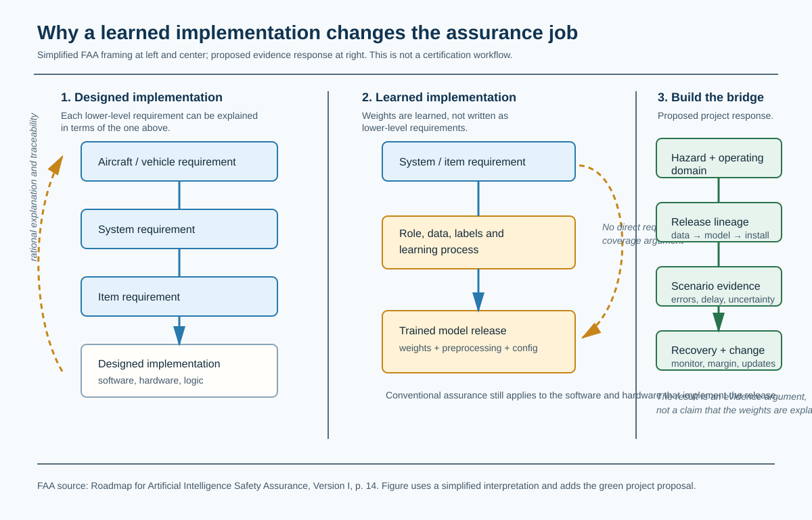
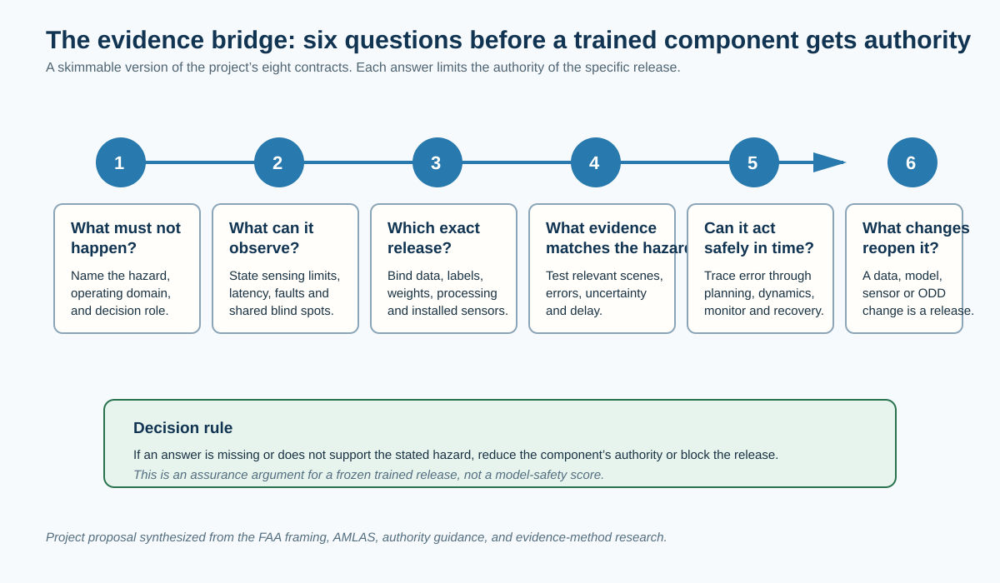
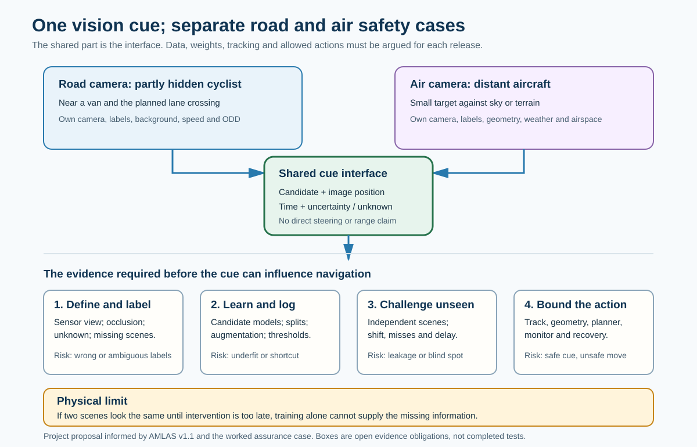
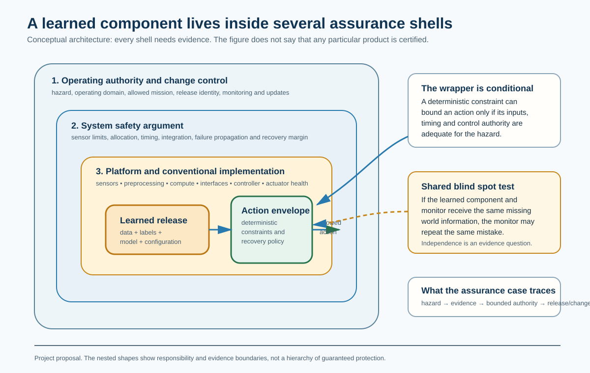
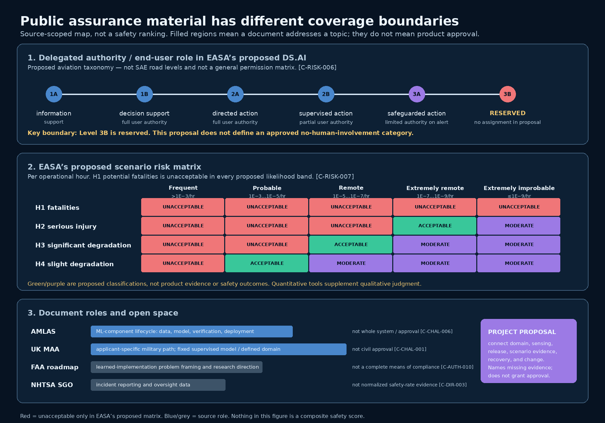
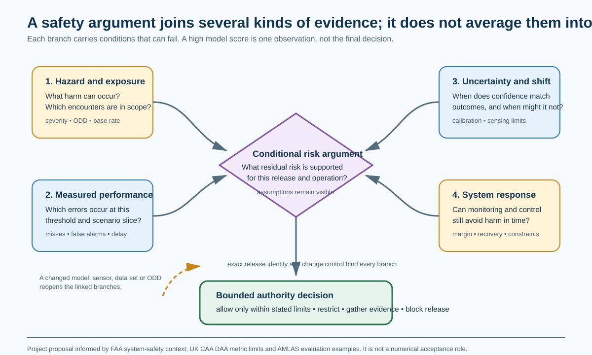

# What Would It Take to Trust a Trained Autonomous System?

## A review prototype for an assurance architecture, from road perception to airborne detect-and-avoid

**Status:** reader-review draft, 25 September 2026. This is a research proposal and a worked assurance case. It does not assess, certify, authorize, or describe the evidence of a real vehicle, aircraft, model, or company.

## Abstract

Safety engineering normally follows a designed chain: aircraft or vehicle need, system requirement, item requirement, then a designed implementation that can be explained against those requirements. A trained model breaks the most direct part of that chain. Engineers choose its job, training data, learning process, and release configuration, but they do not write each learned weight as a requirement. The FAA identifies this as the distinctive assurance problem for learned AI. [C-AUTH-010]

This paper proposes a constructive response for a **frozen, versioned trained model**. Do not pretend that every model weight has a requirement. Instead, build an evidence bridge from the hazardous decision to the operating domain, sensing limits, exact model release, scenario evidence, closed-loop recovery margin, and update control. If a link is missing, restrict the model's authority or block the release.

The paper starts with a car approaching a partly hidden actor, then takes the same assurance structure into an airborne detect-and-avoid encounter. It uses AMLAS as a learned-component lifecycle baseline, compares current UK military guidance and proposed EASA civil material, and keeps their different scopes visible. [C-CHAL-001] [C-CHAL-003] [C-CHAL-004] [C-CHAL-006] The result is not a safety score or an approval recipe. It is a readable and machine-checkable argument about what evidence is still needed.

## How to read this prototype

The manuscript separates three kinds of statement:

* **Source-backed finding** has a stable claim tag such as `[C-CHAL-006]`; the interactive edition links each tag to a source card and the compiler review status.
* **Project proposal** describes the architecture we are building. It is an argument to challenge, not a claim that an authority already accepts it.
* **Open condition** is a proposition that would have to be demonstrated for the hypothetical release. It is intentionally not treated as satisfied.

The paper is designed for a technically literate reader who does not need to be an airworthiness specialist. The sections can be read in sequence, or used as a map for reviewing the companion case graph and source register.

---

## 1. The missing link: learned implementation

In conventional engineering, people design an implementation and can work down from a vehicle or aircraft requirement to a system requirement, an item requirement, and the software or hardware that implements it. The lower-level pieces can be explained in terms of the requirement above them. That is the familiar traceability story.

With a trained model, the team still writes high-level requirements. It still designs the sensors, computer, interfaces, and surrounding software. But the detailed behavior of the model is learned from data. Its weights are the implementation. The FAA’s roadmap says the designer cannot derive lower-level requirements that directly describe that learned algorithm, or show that those requirements cover the higher-level ones in the usual way. [C-AUTH-010]



*Figure 1. Simplified FAA framing at left and center; the green evidence bridge is this project's proposal. Conventional assurance remains relevant for the software and hardware that run the model. The missing direct link concerns explaining the learned model's internal behavior from lower-level requirements.* [C-AUTH-010]

This does **not** mean that requirements disappear, that trained models are unknowable, or that conventional engineering has no role. It means we should not use ordinary requirement-to-code traceability as if it were a complete explanation of learned behavior. A model can be frozen and exactly versioned, yet still make a harmful inference because of an occlusion, a sensor fault, or conditions that the data and tests did not cover.

The first object of this project is therefore a frozen trained release: specific weights, preprocessing, sensor configuration, decision logic, and operating assumptions. The FAA distinguishes that kind of learned AI from a system that continues learning in operation, and says that each updated learned version needs safety assurance. The roadmap is direction-setting material, not a complete acceptance method. [C-AUTH-002]

### The constructive move: replace the missing link with an evidence bridge

The answer is not to ask one metric to certify a neural network. Accuracy, test miles, confidence, simulator crash rate, neuron coverage, and interpretability can each help under stated conditions. None tells us by itself whether the system can make a hazardous decision safely.

Instead, start at the decision that could cause harm and ask the linked questions below. They turn a broad “can we trust the model?” question into reviewable work. A failure at any step reduces the model's allowed authority or blocks its release.



*Figure 2. Plain-language entry to the project’s eight evidence contracts. It is a proposed assurance structure, not an FAA, AMLAS, MAA, or EASA acceptance checklist.*

The rest of the paper adds technical detail to these questions. First, it makes the failure concrete in a road encounter. Then it shows how the same chain changes when the vehicle takes off.

## 2. The worked encounter: a car sees an incomplete world

Consider a car that approaches an intersection or roadside obstruction. A pedestrian, cyclist, or vehicle is partially hidden. The autonomy stack receives sensor data, creates a world representation, predicts possible movement, and selects a path. The example is deliberately generic. It does not reconstruct Tesla or any other company’s private architecture; public road deployment, a product demonstration, or a regulatory investigation does not disclose the evidence behind a particular trained model.

### One vision task, two vehicles

Keep the learned task small enough to inspect. A frozen vision model receives a short sequence of camera frames from an identified, calibrated sensor. Its proposed output is a **navigation-relevant hazard cue**: a candidate object or unexplained region, image location or bearing, timestamp, and uncertainty/unknown indication. It can flag that the planned path may be obstructed. It does **not** directly output a steering command, establish range from a single frame, or prove that every unseen object has been found. Tracking, geometry, other sensors where needed, a constrained planner, and a recovery path must turn a cue into an action. This is the project's proposed interface, not a description of a deployed product.

| Same question | Road scene | Airborne scene |
|---|---|---|
| What should vision flag? | A partly visible cyclist entering the route behind a van. | A small, noncooperative aircraft against sky or terrain. |
| What may it report? | Candidate location, time, uncertainty, and “view obstructed.” | Candidate bearing or image region, time, uncertainty, and “track not established.” |
| What must other parts establish? | Relative motion, drivable space, braking/steering margin and whether slowing is safe. | Range and range rate from supported tracking/fusion, separation margin, maneuver clearance and right-of-way rules. |
| What remains open? | A hidden actor may produce no distinguishing pixels before a deadline. | A distant object may not yield a usable track soon enough for an escape. |



*Figure 2a. A shared **interface**, not a transferable model or transferable approval. The road and airborne releases require different data, labels, scene partitions, geometry and action limits. The safety case must test what happens when the image is ambiguous or the cue arrives too late.*

Calling this “anomaly detection” is useful only if we state the anomaly relative to something: unexpected content in the planned route or an approaching object in a watched sector. An unfamiliar object might also be outside the model's class list. A high confidence score on a familiar label must not silently turn “unknown” into “clear.” If two physical scenes produce the same relevant sensor evidence until the last recoverable moment, training alone cannot distinguish them; the operating rule, sensor design, speed or authority must change. [C-TRAIN-001] [C-TRAIN-003]

The technical question is sharper than “does the detector work?” There are two physical worlds:

1. The near lane is empty.
2. An actor is present but occluded, or appears in a way that the perception system fails to distinguish.

If the relevant internal state presented to a deterministic planner is the same in both worlds, that planner has no information with which to choose differently. That is an information problem before it is a software-execution problem. The case must show either that the relevant difference becomes observable early enough, or that the vehicle is restricted so it never needs that distinction at the stated speed, geometry, and conditions.

The proposed chain is shown below. The central design question is the arrow into the safety monitor: does it have a sufficiently capable observation path to notice the failure that matters, and can it still place the vehicle in a recoverable state?

```text
Operating domain and rules
        │
Sensors and health checks ──► learned perception ──► world state / prediction
        │                                                   │
        └──► safety observations ──► monitor ──► authority selector ──► actuation
                                                    ▲              │
                                         recovery controller         ▼
                                                                  vehicle + world
```

This is a project architecture, not a claim that a second sensor or a monitor automatically makes a system safe. If the monitor sees only the same missed object representation as the planner, it may share the failure. A separate box has added no information. The safety argument then needs an evidence-backed, sufficiently independent observation path, a bounded operational restriction, or a different allocation of decision authority. The conditional nature of runtime assurance is important: formal results about switching to a safe controller depend on monitor, timing, dynamics, and recovery premises. [C-EVID-005]

### A concrete failure trace

Suppose an object is hidden behind a parked vehicle. The camera’s view is reduced; radar returns are degraded by geometry; the predicted path says the lane will remain clear. The planner maintains speed. A late detection occurs, but braking distance and steering constraints leave no safe maneuver. A technically sound assurance argument cannot stop at the detector’s held-out precision and recall. It must connect:

* the operational envelope and hazard definition;
* the sensing and preprocessing configuration;
* the data, label, training and release lineage;
* evaluations that expose false-negative and latency behavior in relevant scenario partitions;
* closed-loop vehicle dynamics and constraints; and
* monitor switching delay and the recovery envelope.

Those are the eight contracts introduced below. Their purpose is to prevent a result from one layer from being casually used as proof for another.

> **The proposed assurance rule.** A frozen trained component may influence a hazardous maneuver only when a versioned release, bounded operating domain, observable hazard distinction, hazard-partitioned performance evidence, closed-loop margin, useful intervention/recovery, system composition, and change control are argued together. A failure in any one proposition restricts its authority or blocks the release.

This is the paper's proposed answer, not a test that an authority has adopted. The rest of the paper asks what would count as evidence for each term, which existing methods help, and where an argument can still fail.

## 3. The assurance object: an evidence graph, not a folder of reports

A release is more than a model file. For the prototype road case, the release node represents a frozen trained perception configuration, named `REL-ROAD-001`. It is associated with a hazard: an occluded road actor is missed or detected too late, leaving no safe avoidance maneuver. It also carries explicit assumptions: the encounter stays inside a stated operating domain; the installed sensor/preprocessing match evaluation; enough time and control authority remain after a late result; a monitor has an independent-enough observation path or an operational restriction; and changes create a new release.

Every one of those assumptions is currently **open**. This is intentional. The graph makes the missing proposition visible rather than allowing it to be buried in prose.



*Figure 3. A learned component is only one part of a release-level assurance argument. The green action envelope is a project design pattern, not a claim that a generic deterministic wrapper makes a learned system safe. It must have sufficient observations, time, and control authority; a monitor can share the learned component's blind spot.* [C-EVID-005]

For each hazard, the project defines eight evidence contracts:

| Contract | The question it forces | Example evidence object |
|---|---|---|
| O-001: scope and authority | What operation, hazard, delegated decision and margin are being claimed? | ODD, hazard analysis, authority statement |
| O-002: observability | What can the sensors and preprocessing distinguish, and when? | sensing limits, latency, calibration and common-cause analysis |
| O-003: lineage | Which data, labels, training choices, weights and deployment transforms define this release? | versioned release manifest |
| O-004: hazard-relevant performance | How do errors, uncertainty and delay behave in the stated encounter classes? | held-out, shifted-condition and closed-loop results |
| O-005: closed-loop behavior | How does a perception error propagate through planning, actuation and dynamics? | simulation, test, constraints and last-recoverable-state analysis |
| O-006: intervention and recovery | What does the monitor observe, how quickly can it act, and what recovery is possible? | monitor logic, switching evidence and recovery envelope |
| O-007: composition | What happens when sensing, planner, controller, people, other actors and rules interact? | integration and failure-propagation evidence |
| O-008: change control | What changes reopen the argument and what evidence must be repeated? | impact analysis and operational-monitoring record |

These are **project-defined contracts**. They are not a newly issued standard and they do not claim sufficiency for an approval. Their value lies in composition: a reader can see which claim supports which contract, which evidence artifact is expected, which artifact depends on a particular model release, and what downstream manuscript/video statement must be reconsidered if a source, assumption, or artifact changes.

### Why the graph matters

The earlier verification-compiler project argued that ordinary folders do a poor job of representing evidence relationships. The same issue appears here, but with a more consequential subject. A CSV of scenarios, a model card, a simulator result, an interpretability graphic, an operational permit, and a software version may all be real artifacts. None says how it bears on a particular hazardous decision unless the relationships are explicit.

The project compiler therefore builds review packages for factual claims and records source-support, challenge, cross-artifact, and eventual human-disposition work. It also connects claims to hazard, assumption, release, evidence-artifact, and obligation nodes. A change to sensor configuration, weights, operational domain, or an authority source can identify affected text and reopen linked evidence. This is traceability infrastructure. It does not establish that a physical system is safe.

### A bridge from conventional safety software

The proposal is not an attempt to discard conventional traceability. It extends it around the sources of variation that matter for a frozen trained release.

| Conventional software-assurance object | Trained-system counterpart | Additional question that must be answered |
|---|---|---|
| configured source, toolchain and build | data, labels, split, learning configuration, weights, preprocessing and deployment transform | Does this exact release support the claimed operating domain? |
| requirement-based test | scenario-partitioned, held-out and shifted-condition evaluation | Does the measurement expose the harmful error and its latency? |
| integration test | closed-loop encounter, dynamics and recovery evidence | After an error, is there still a safe action available? |
| configuration/change impact | release graph including data, model, sensors, monitor and ODD | Which evidence must be repeated after a material change? |

The familiar discipline remains: identify an object, define the claim, preserve the version, inspect the evidence, and revisit it when inputs change. What is added is an explicit link between a model result and the world condition in which that result matters. That link cannot be replaced by a more elaborate model card.

## 4. Existing methods: enough to reject a vacuum, not enough to skip the hard parts

The research began with the question, “do defined processes for trained systems exist?” The answer is not a clean yes or no. Public material contains real lifecycle methods and authority paths. Their scope and status differ, and none should be promoted beyond its published role.

### A status ladder, not a winner's podium

The useful comparison is not “which standard solves AI safety?” It is “what kind of object is this document, and what job can it do?” A statute or binding rule defines a legal duty. Authority guidance can explain an acceptable route or a candidate route. A consensus standard or research method can provide a shared vocabulary and an evidence pattern. A product assurance case applies those patterns to one release, one operating domain and one hazard. None of the upper layers reveals the lower layer's actual evidence by itself.

This ladder matters because the public landscape is neither empty nor finished. The FAA's current AI/ML discipline describes work with industry, government, standards-development organizations and academia to understand algorithms, data and model performance within the certification framework. That is evidence of active method development, not evidence that a final high-criticality method has been adopted. [C-STD-001] EASA's DS.AI material is detailed enough to be useful in a crosswalk, but the captured rulemaking status still labels its NPA as proposed and awaiting comment responses. [C-STD-002]

The paper will therefore use the phrase **unfinished, fragmented public pathway** for the difficult learned-component case. It is a claim about the status and scope of material that can be inspected here. It does not imply that every applicant lacks a private method, that an authority cannot make a project-specific decision, or that research methods such as AMLAS do not exist.

### Why a road launch and an aircraft approval are not comparable verdicts

In the United States, a road-vehicle manufacturer or distributor certifies that a vehicle or item of equipment complies with the applicable Federal Motor Vehicle Safety Standards. The statute includes a reasonable-care constraint on a certificate that is materially false or misleading. [C-STD-003] NHTSA also states, in a nonbinding interpretation, that it does not pre-approve new vehicles, equipment or ADS technologies; it describes manufacturer self-certification, applicable FMVSS and safety-defect authority as different parts of the oversight arrangement. [C-STD-004]

That is not a general manufacturer declaration that a trained perception model is safe in every scene. It is also not evidence that road deployment has no safety obligations. For this paper, keep three tracks separate: **product compliance**, **operational permission**, and **the technical evidence for a specific learned-component claim**. Aviation similarly separates equipment, installation, aircraft and operation. A reader should be able to see which track a source belongs to before drawing any conclusion from a permit, a standard, a product announcement or an investigation.

### AMLAS: a learned-component baseline

The University of York’s AMLAS guidance organizes assurance of a machine-learning component into six stages: safety-assurance scoping, requirements, data management, model learning, model verification, and deployment. AMLAS explicitly limits itself to the ML component, says it needs complementary system and domain assurance, and focuses primarily on offline supervised learning. [C-CHAL-006]

In the project crosswalk, AMLAS directly informs release lineage and partially informs observability and hazard-relevant performance. It does not alone establish the road vehicle’s braking envelope, the air vehicle’s maneuver authority, the operational rules, or a regulator’s authorization. A model lifecycle is necessary evidence, but it is not the whole safety case.

### The learned component has its own engineering failure modes

A safety software review asks about memory faults, timing, priority inversion and other known ways an implementation can go wrong. A trained vision component has different, equally concrete design traps. AMLAS is valuable here because it does not stop at “collect data and test accuracy.” It requires data requirements tied to the intended operating domain and asks about relevance, completeness, accuracy and balance. Its examples make sensor viewpoint, lighting and labels for partly hidden pedestrians explicit. [C-TRAIN-001]

For our two scenes, this means the team must decide what counts as a candidate hazard, what evidence is actually visible, and how to label an ambiguous or occluded frame. A ground-truth annotation that knows an aircraft is present from other sensors does not make that aircraft visible to the camera at that instant. The model cannot be blamed for failing to infer information absent from its input, and the safety argument cannot treat the frame as an ordinary negative example. The project would record such cases as an observability limit and either add information, reduce speed/authority, or exclude the encounter from the claimed domain.

| Design trap | How it could appear in the shared vision task | Evidence the proposed case would demand |
|---|---|---|
| **Underfitting** | A model too limited for the chosen representation misses small or partly visible objects in development **and** independent tests. | Learning curves and errors by size, occlusion and background; reconsider capacity, features, data or the task. [C-TRAIN-004] |
| **Overfitting or shortcut learning** | Development scores look strong, while a new route, sky, camera or weather condition fails; the network may use a simulator artifact or background cue. | A logged candidate-selection history; separate capture groups and shifted-condition tests; challenge the suspected cue. [C-TRAIN-002] [C-TRAIN-003] |
| **Label error or hidden ambiguity** | Two labelers disagree about a partially occluded actor, or a hidden object is marked “clear” because no visible pixels reveal it. | Written label policy, adjudication record, disagreement sample and an explicit “unknown/occluded” outcome. [C-TRAIN-001] |
| **Leakage** | Near-duplicate frames from one drive or flight appear on both sides of a split, or the supposedly final challenge set guides repeated tuning. | Split by scene/capture event and provenance; locked verification set; record access and every tuning decision. [C-TRAIN-002] [C-TRAIN-003] |
| **Wrong operating point** | A threshold improves average accuracy while missing late collision cues or causing unsafe false alarms. | Error costs, threshold rationale, misses, false alarms, calibration and time-to-usable-cue by hazard partition. [C-RISK-005] |
| **Safe cue, unsafe action** | Detection succeeds but range/range rate, planner delay or maneuver clearance is wrong. | Closed-loop encounter traces and the monitor's independent observation and recovery margin. [C-EVID-005] |

The textbook distinction between underfitting and overfitting is a useful diagnostic: too little effective capacity can leave both training and test errors high; an overfit learning setup can show a large training-to-test gap. Real failures are not diagnosed from that graph alone. Data composition, optimization, labels and the test distribution also matter. A model that scores well on one independent set has demonstrated behavior on that set. It has **not** proven that it learned the intended physical concept rather than a convenient correlation, or that it will generalize to every future encounter. [C-TRAIN-004] [C-TRAIN-003]

**Project-proposed training and review sequence for this vision cue:**

1. **Specify the dangerous decision first.** Name the road or air operating domain, sensor geometry, time-to-action boundary, what the cue means, and when “unknown” must restrict authority. The two releases share an interface, not weights, dataset adequacy or an approval claim.
2. **Write data and label requirements before model selection.** Partition object size, partial visibility, background, glare, weather, camera health, approach geometry and actor behavior. Define who adjudicates ambiguous frames. Record which factors are absent or physically unobservable. AMLAS supplies the component-level rationale for these data questions. [C-TRAIN-001]
3. **Train candidates against development data and log choices.** Compare an intentionally simple baseline with larger candidates; record architecture, augmentation, simulator use, regularization, thresholds, toolchain and each selection. If a small model fails even on its training task, investigate underfitting. If training looks strong but distinct capture groups fail, investigate overfitting, spurious cues or shift. AMLAS calls for a model development log and explicitly discusses overfitting and simulator artifacts. [C-TRAIN-002] [C-TRAIN-004]
4. **Keep an independent challenge set.** Hold out whole scenes or collection campaigns where feasible, not adjacent frames from the same encounter. Ask a separate team to seek realistic failure classes inside the stated domain: occlusion plus glare, small airborne targets against terrain, altered camera position, degraded image quality and unfamiliar objects. Freeze the candidate and threshold before final evaluation; expose any verification-set peeking as a failed process condition. AMLAS describes independent verification data and review proportional to criticality. [C-TRAIN-003]
5. **Measure the outcome the hazard needs.** Report misses, false alarms, delay, uncertainty and time to a usable track in each relevant partition, with confidence intervals and the tested population where meaningful. Then run the cue through tracking, planning, dynamics and recovery. A recognition result alone is not a navigation result.
6. **Bind the release and repeat affected evidence after change.** Hash the weights and preprocessing, identify the camera and calibration, preserve training and verification data lineage, and reopen the relevant tests if any of these, the route domain, or downstream action logic changes. A smaller or more interpretable model still needs this evidence.

This is a **proposed** system-level use of AMLAS, not a claim that AMLAS prescribes grouped holdouts, an “unknown” class, or these exact road/air scenarios. The worked graph has no real training data, model, results or accepted threshold yet. The sequence therefore creates obligations, not a passing safety case.

### UK MAA: a case-specific military path

The UK Military Aviation Authority’s current AI notice provides an applicant-specific path for certified military air systems. It calls for an MCRI to be agreed with the MAA and recommends fixed supervised models within a defined operating domain for early safety-related ML applications. It remains military guidance, not a civil airworthiness approval or a public product safety case. [C-CHAL-001]

The important lesson is architectural rather than jurisdictional. The notice makes room for a case-specific argument and for mitigation where a prescriptive solution is unavailable. That supports the paper’s insistence that monitor observability, recovery, and operational restrictions are explicit design propositions. It does not permit the project to transfer a military conclusion into FAA or EASA approval language. [C-CHAL-002]

### EASA: an emerging detailed civil framework with an explicit boundary

EASA NPA 2025-07(B) is a detailed proposed framework for AI trustworthiness. Its proposed material spans operational domain, risk assessment, development assurance, learning assurance, lifecycle data, and in-service monitoring. It is not final material. Its scope also excludes systems directly contributing to fatalities or multiple life-threatening injuries, a boundary that matters for the airborne transfer case. [C-CHAL-003] [C-CHAL-004]

This is a productive constraint. It means the paper can use the NPA to identify candidate objectives and evidence categories, while preserving the fact that the hardest collision-avoidance role is not thereby accepted. The project will track future EASA and EUROCAE publication status rather than treating a proposal as a settled means of compliance.

### Road guidance and standards

Road autonomy has developed its own vocabulary and safety-case practices. ISO/PAS 8800 addresses safety and AI in road vehicles, including a trained AI model; UL 4600 supplies a goal-based framework for evaluating autonomous products. Published scope and a voluntary standard show that assurance work exists. They do not show that a particular product received an authority’s approval, or disclose a proprietary model’s data and evidence. [C-AUTH-006] [C-AUTH-007]

NHTSA’s public ADS guidance makes a similarly useful distinction: its voluntary safety self-assessment process is not a federal approval. Current policy is evolving, so status must be checked before publication. The project treats an operating permission, an exemption, equipment conformance, state deployment conditions, and model evidence as different graph edges. [C-AUTH-008]

### What the crosswalk contributes

The project maps AMLAS, MAA, and EASA material to the eight contracts. The mapping asks whether a method covers an obligation directly, partly, as a proposal, or outside scope. It then names the evidence artifact still required by the worked case. This avoids two mistakes: claiming that our architecture invents a lifecycle from nothing, and claiming that a named methodology closes a hazard without case evidence.

### A coverage map, not an approval ladder

The useful visual question is not “which document is strongest?” It is “what region of the problem does each document actually address?” The map below places the public material against two boundaries that are often blurred: **how much authority is delegated to the system**, and **what hazard/risk category the document discusses**.



*Figure 5. A source-scoped coverage map. It shows documented scope, not acceptance, safety, maturity, or product approval. EASA NPA 2025-07(B) is proposed material. Its Level 3B is reserved, and its H1/fatality row is unacceptable across the proposed likelihood columns. AMLAS, MAA, FAA and NHTSA occupy different roles rather than competing “certification levels.”* [C-RISK-006] [C-RISK-007] [C-CHAL-001] [C-CHAL-006] [C-AUTH-010] [C-DIR-003]

EASA's proposed classification is especially easy to overread. Levels 1A through 3A have stated forms of end-user authority and responsibility. Level 3B is simply marked **reserved**, with no authority or responsibility assigned. It is therefore not evidence that EASA has defined, accepted, or rejected a general “no human in the loop” mode. It is a visible boundary in one proposed aviation framework. [C-RISK-006]

The map also explains why the public landscape looks fragmented. AMLAS is an ML-component lifecycle; the MAA material is a case-specific military route; the FAA roadmap frames an assurance problem and research direction; NHTSA's standing order collects incident information. They are not alternative approvals for the same system role. The open region on the graphic is deliberate: this paper's proposed evidence graph tries to make the missing case-specific links inspectable, but it is not itself an authority process.

## 5. Evidence methods and the limits of their claims

The assurance case needs varied evidence because different failure mechanisms leave different traces. The following methods are not competing safety scores; they are lenses with stated preconditions.

### A risk argument is not a model metric

Conventional system-safety practice asks what failure could occur and treats a more severe outcome as demanding a lower acceptable likelihood. That is useful context, but it does not turn a held-out detection result into a learned component's failure rate. A learned perception error depends on the particular encounter distribution, sensing configuration, threshold, delay, downstream decision and recovery path. [C-RISK-001]

The useful question is therefore not “what is the model's safety number?” It is “what does this measurement tell us about this hazard, and what other evidence must be true before the release can take this action?” The UK CAA's DAA material makes the danger of aggregation concrete: an average risk ratio can conceal a deficient encounter class. AMLAS's threshold and confusion-matrix example makes the same teaching point from another direction: false alarms and misses have different costs, so an operating point is a contextual choice. [C-RISK-004] [C-RISK-005]



*Figure 4. A project evidence graph for a conditional risk judgment. It keeps hazard exposure, measured model behavior, uncertainty, recovery and the resulting authority decision separate. It is not a formula, a regulatory threshold, or a composite safety score.* [C-RISK-001] [C-RISK-004] [C-RISK-005]

### What EASA's proposed numbers actually mean

EASA's NPA supplies a concrete example of how one authority proposal turns qualitative hazards into a bounded risk process. It defines likelihood **per operational hour**: frequent is greater than `1E−3` per hour; probable falls between `1E−3` and `1E−5`; remote between `1E−5` and `1E−7`; extremely remote between `1E−7` and `1E−9`; and extremely improbable is `1E−9` or lower. Those are not loss-of-life-per-mile numbers, and they are not a conversion from a model's accuracy percentage. [C-RISK-007]

Its proposed matrix makes the policy boundary visible. Every H1 scenario—potential fatalities—is classified as unacceptable, even at the extremely-improbable likelihood band. H2, potential serious injury, becomes acceptable only in the extremely-remote band and moderate in the extremely-improbable band. H3 and H4 have different cells. The proposal aggregates scenarios using the most stringent hazard category, then maps non-unacceptable results to proposed assurance/tool-qualification levels. It also says quantitative tools supplement rather than replace qualitative engineering and operational judgment. [C-RISK-007]

That is an important finding, with three limits. First, it is an **EASA proposal**, not a final approval rule. Second, it uses per-operational-hour scenario assumptions that must be stated for a real case. Third, it is not proof that “the industry refuses AI risk.” The same proposal describes acceptable and moderate categories for some lower-severity/likelihood combinations. What it does show is that its authors did not offer this framework as a path for an AI operation with a direct H1/fatality potential at the time of publication. [C-RISK-003] [C-RISK-007]

### Road incidents and electric vehicles: useful context, wrong denominator

Public road data can tell us about oversight and exposure measurement without answering whether autonomy is safe. NHTSA's Standing General Order maintains ADS and Level-2-ADAS incident data, but its own current data dictionary says access to crash data can affect reporting, incident data may be incomplete or unverified, a crash may have multiple reports, and summary data are not normalized. The log is useful for discovering events and potential defects; it is not a comparative crash-rate denominator or a learned-model safety result. [C-DIR-003]

The electric-vehicle comparison has the same discipline problem. In its 2016 quiet-car rulemaking, NHTSA said it could not directly measure pedestrian and pedalcyclist crash rates per mile for hybrid/electric vehicles against internal-combustion vehicles because it did not have powertrain-specific vehicle-miles-traveled data. It used proxy and case-control analysis with stated confounding limits. That does not establish today's all-crash EV risk, but it demonstrates why a headline comparison needs a defined population, miles, crash endpoint, vehicle age, driver mix, operating setting, and control for confounders. [C-DIR-002]

For this project, an EV-versus-ICE accident number cannot stand in for an autonomous-system risk target. Powertrain, vehicle design, driver behavior, automation level, incident reporting, and exposure are different variables. The right video visual is a denominator ledger: a numerator becomes a risk estimate only after its vehicle population, operating domain, miles or hours, event definition, and data-quality limits are attached.

### Professional qualification is not a maturity test

The intuition that a safety-critical field needs people capable of challenging its practice is sound. The proposed conclusion—that professional societies, evaluation boards, and standards can form only after a profession is mature enough and has enough qualified people—is **not supported by the evidence collected for this paper**. It should not be used as an explanation for the present state of ML assurance without targeted historical research.

One narrower fact is inspectable. NCEES's current PE page describes discipline-specific competency and more than 20 PE examinations. Its list includes computer engineering but no machine-learning specialty. That records the current taxonomy of one U.S. licensure body. It does not establish the absence of university, vendor, employer, association, state, or international credentials; it says nothing about the competence of working ML engineers; and it does not explain why a specialty is or is not regulated. [C-DIR-001]

The constructive implication is more useful than a maturity narrative. A real learned-system case should name the competence required for each assurance judgment—system safety, data curation, model evaluation, sensing, control, human factors, operations, and independent review—and show who is qualified to make it. A job title or a missing credential is not evidence by itself. This becomes a future evidence contract for the public release, not a claimed explanation of standards development today.

### Scenario coverage is a model of the scenario space

Combinatorial methods can make selected combinations of scenario factors visible and expose gaps in a test plan. That is valuable when the factors, bins, and interaction strength are justified. It does not prove coverage of a causal factor that the analyst did not include. [C-EVID-002]

For the road case, a scenario taxonomy should state occlusion geometry, speed, road layout, lighting, weather, sensor health, object class, range/range rate, and other-actor behavior. It should also name what it omits. An apparent high coverage result is conditional on this taxonomy.

### Rare-event statistics are conditional on the generator and simulator

Rare-event simulation can estimate a selected risk under a specified simulator, base distribution, and hazard threshold. It can make an otherwise impractical test problem tractable. Its result does not travel automatically to changed sensor rendering, a different tail distribution, or an environment whose dangerous cases are not represented by the generator. [C-EVID-003]

The graph therefore treats simulator version, scenario distribution, and hazard threshold as evidence-bearing configuration. A collision estimate is not a free-floating property of the model.

### Confidence needs calibration, partitioning, and a response rule

Calibration can be measured and improved on a stated evaluation distribution. It is useful when a component’s confidence affects whether the planner may proceed, slow down, seek more observation, or cede authority. Demonstrated calibration on one evaluation distribution does not establish calibration under shifted conditions. [C-EVID-004]

The proposed case therefore asks not only whether a confidence value looks high, but whether calibration has been evaluated by operational partition and what action follows when uncertainty exceeds the claimed authority envelope.

### Runtime assurance is a conditional safety argument

Formal runtime-assurance work can establish a safety implication for an advanced component when the monitor observes the relevant condition, detects it soon enough, the switch completes within a bound, dynamics stay within a model, and a fallback can reach a safe state. [C-EVID-005]

The occlusion example tests the first premise. If neither primary perception nor the monitor can distinguish the hazardous world before the last recoverable state, no monitor proof begins. This is why monitor independence must be an evidence obligation, not a decorative architecture diagram.

### Interpretability and coverage metrics can challenge a story; they cannot replace one

Saliency or feature-attribution visuals can help form hypotheses about why a model responded. Randomization checks show why a persuasive visualization must be tested for dependence on model and data structure before it is used as evidence. [C-EVID-006] Neuron-coverage research likewise provides a reason to investigate a metric, not a causal guarantee that higher activation coverage means lower hazardous behavior. [C-EVID-007]

Model compression, mechanistic inspection, and symbolic equation discovery may become useful engineering tools. The paper does not assume that a smaller network, a readable latent vector, or a recovered physical equation proves safety. Each tool must answer a specific claim about a specific failure mechanism and be checked against counterexamples.

| Method or metric | Useful, bounded role | What it cannot close on its own |
|---|---|---|
| Scenario taxonomy and combinatorial coverage | Shows the chosen factor space and its explored combinations | Causal factors omitted from the taxonomy; a safety conclusion |
| Rare-event simulation | Estimates a selected event under a stated generator, simulator and threshold | Fidelity under unrepresented sensor/rendering or distribution change |
| Calibration | Supports an authority restriction policy on an evaluated partition | Hazard awareness or calibration after shift |
| Runtime monitor proof | Proves a conditional implication after stated observation and recovery premises | An unobservable or too-late perception failure |
| Attribution / interpretability | Challenges a story about which features matter | That the system will act safely in the world |
| Neuron/activation coverage | Supplies a test-adequacy diagnostic to investigate | A causal relationship to hazardous behavior |

## 6. The road case, written as a reviewable assurance argument

The following is the first-pass argument for `REL-ROAD-001`. It is intentionally incomplete.

**Claim R1 — bounded authority.** The hypothetical release may influence an avoidance decision only inside a declared road operating domain, with a stated hazard, speed/geometry limits, and a defined allocation of authority. This is an open obligation, `O-001`.

**Claim R2 — observable difference.** The deployed sensing and preprocessing configuration can distinguish the relevant hazardous encounter, or the operational restriction makes the distinction unnecessary. This is `O-002`; its central open condition is `AS-ROAD-004`.

**Claim R3 — release lineage.** The data, labels, splits, learning configuration, weights, transformations, sensor configuration, and planner/monitor interfaces are tied to one frozen release. This is `O-003`.

**Claim R4 — hazardous-performance evidence.** Evaluation measures false negatives, false positives, delay, and calibration over scenario partitions that matter to the hazard, including shifted conditions. A rare-event result carries its simulator and distribution assumptions. This is `O-004`. [C-EVID-002] [C-EVID-003] [C-EVID-004]

**Claim R5 — closed-loop margin.** A perception error is traced through prediction, planning, actuation, and vehicle dynamics, so a late correct detection cannot be mistaken for a safe outcome. This is `O-005`.

**Claim R6 — recovery is useful.** The monitor observes a differentiating signal soon enough, switching occurs within a bound, and the recovery controller can reach a safe state. For an airborne active escape, that proposition also includes an evidence-backed traffic-and-clearance path for the maneuver itself; a later landing or diversion plan is not that path. If this cannot be shown, the release remains blocked or the domain/authority is restricted. This is `O-006`. [C-EVID-005]

**Claim R7 — composition remains safe enough.** Sensor disagreement, degraded observation, other actors, human interactions, and operational rules have been considered where they can defeat the preceding claims. This is `O-007`.

**Claim R8 — change reopens evidence.** A change to training data, labels, weights, preprocessing, sensor hardware, planner, monitor, or the operating domain creates a new release and a declared impact assessment. This is `O-008`. [C-AUTH-002]

At present, these are not closed claims. The associated evidence artifacts are all planned. The graph’s honest output is a blocked release, not a probability of safety.

## 7. Let the car take off

Now move the visual architecture into an airborne detect-and-avoid encounter. The hypothetical release `REL-AIR-001` must distinguish an approaching aircraft early enough to warn, maneuver, or otherwise maintain separation. It may use camera, radar, cooperative surveillance, acoustic sensing, or fusion; this paper makes no claim about the performance of a specific sensing suite.

The **vision-cue interface** remains: candidate object or unexpected region, image location/bearing, timestamp and uncertainty. The camera and release do not carry over. A road-trained model cannot be presumed to recognize aircraft; an air model needs its own labels, backgrounds, optical geometry, split groups, rare encounter classes and independent verification. A single image bearing is not range or collision probability. If the encounter requires range rate, the case must show how a tracker or another sensor obtains it soon enough. The action logic then has to preserve separation and clearance, including during the recovery maneuver. [C-TRAIN-001] [C-TRAIN-003] [C-EVID-005]

The same contracts survive, but their content changes.

| Question | Road encounter | Airborne encounter |
|---|---|---|
| Operating domain | road geometry, speed, weather, lighting, road users | airspace, traffic mix, weather, sensing range, cooperative status, operating rules |
| Hazard | actor missed or late; no safe braking/steering response | aircraft missed or late; insufficient separation or maneuver margin |
| Sensing | occlusion, camera/radar health, near-field geometry | angular resolution, range/range rate, background clutter, weather, cooperative/noncooperative traffic |
| Time and control | braking, steering, friction, vehicle envelope | closing rate, vertical/lateral maneuver limits, alerting delay, separation standard, flight envelope |
| Recovery | controlled slowdown, lane position, minimum-risk maneuver | maneuver, alert, contingency operation, landing or other bounded safe state |
| Authorization | road rules, vehicle compliance, deployment/operational permissions | equipment, installation, aircraft, operational and airspace approvals |

The comparison should resist two lazy conclusions. Flight is not simply road driving at a higher consequence level, and a car’s ability to stop is not a general safety fallback. But neither does aircraft geometry by itself make the learned component impossible to assure. The evidence must answer the actual observability and recoverability question.

The transfer has a stable core. Both cases need a release identity, a bounded domain, scenario-conditioned evidence, a monitor premise, closed-loop margin, and change impact. The air case changes the content of those arguments. Detection must become a usable track before a decision deadline; alerting and maneuver coordination consume part of the separation margin; traffic may be cooperative or noncooperative; and a response must preserve separation rather than simply reduce speed. A landing can be part of a later contingency plan, but it should not be presented as an immediate collision-avoidance fallback.

One useful non-normative accounting aid is a timeline:

```text
detection / track establishment → decision or alert → authority switch → control response → last recoverable separation
```

The case must supply evidence for the duration and uncertainty of each interval. The line is not a separation formula and carries no universal threshold. It prevents a late but technically correct detection from being counted as a safe detection.

The airborne case begins with five open assumptions: an airspace/traffic/weather/sensing envelope; a matching sensing and preprocessing configuration; sufficient remaining separation and maneuver margin after a late track; an evidence-backed, independent-enough traffic-and-clearance observation path for an active escape, or an operational restriction; and full change impact for learned weights, sensing, fusion, alerting, maneuver logic, and the operating domain. The associated evidence artifacts are still planned. The MAA path and EASA proposal give useful comparison points, but neither closes this case. Whether a particular DAA function falls within EASA’s stated high-consequence boundary depends on a system-level failure-condition allocation that this hypothetical case has not made. [C-CHAL-001] [C-CHAL-003] [C-CHAL-004]

This is also where public claims about “certified DAA” require care. For this paper, equipment authorization, installation approval, an aircraft’s airworthiness basis, an operational permission, a military certification, and an underlying learned perception assurance argument are separate objects whose applicability depends on jurisdiction and product. In the narrower U.S. example, a TSO authorization is distinct from installation or operational use approval. [C-002] The paper will only make a product-specific statement after retrieving and reviewing a primary authorization whose scope can be stated precisely.

For a reader coming from the DAA question, that distinction is the immediate practical takeaway. A public statement may identify a certified piece of equipment or a permitted operation while leaving the underlying sensing architecture, model version, installation constraints, and encounter evidence unavailable for inspection. Conversely, a strong model evaluation paper does not itself authorize installation or operation. The graph holds these as separate claims because merging them creates an attractive but false conclusion: that a visible approval label tells us everything needed about a trained perception decision.

## 8. A verification compiler for the paper itself

The project’s own process should be held to a version of the discipline it recommends. The compiler does not decide whether a vehicle is safe. It verifies the internal state of the research argument.

For each factual source-backed claim, the compiler builds separate packages for:

1. **Source support:** does the inspected source context support the exact wording, scope, and date?
2. **Challenge:** what evidence, counterexample, or interpretation could defeat it?
3. **Cross-artifact consistency:** do paper, narration, captions, and diagrams preserve the same limit?
4. **Human disposition:** has a reviewer examined the outstanding issues and recorded a decision?

The project currently has 89 source records and 94 provisional claims. The interactive edition links to the generated compiler report for the live review-gate count. This draft deliberately does not present that count as a fixed property of the paper: any material change to a manifested claim use correctly invalidates affected review packages and requires fresh review. Three known source-support limitations concern short excerpts without captured full original context for `C-002`, `C-AUTH-002`, and `C-AUTH-008`; there are no human dispositions. A verification-gate percentage is never a safety probability, a confidence score, certification evidence, or an approval threshold.

The case also reports its physical-assurance blockers: two releases are only defined; ten assumptions are open; ten evidence artifacts are planned; and sixteen obligations are open. That is expected for a design prototype. A “green” build would be suspicious if it were produced before a real model, data lineage, sensing configuration, operational domain, closed-loop evidence, and authority basis existed.

The next compiler extension should make change impact more precise: a source correction should identify particular claims, a sensor change should identify particular releases and scenario tests, and a figure revision should identify the exact visual assertion it changes. The immediate goal is an inspectable and contestable paper, not an automated certificate issuer.

## 9. What this work says about certification today

The public record supports a more useful position than either extreme.

It is wrong to say that trained autonomous systems have no assurance processes. AMLAS, road safety standards, case-specific military guidance, proposed civil AI material, scenario methods, calibration analysis, runtime assurance, and safety-case approaches all provide real structure.

It is also wrong to convert that structure into a story that learned decision-making has already crossed every flight-critical boundary. The methods are conditioned by scope, assumptions, document status, and evidence. Within this project’s retrieved and inspected public sources as of 16 September 2026, we have not yet located a final, publicly inspectable civil lifecycle that closes the project’s highest-consequence hypothetical case. This is a dated retrieval result, bounded by the [retrieval log](../research/retrieval_status.md), not evidence about private programs, all jurisdictions, or future methods. [C-CHAL-003] [C-CHAL-004] [C-CHAL-006]

The practical path is therefore neither “wait for a magic standard” nor “collect enough driving miles.” Build a case whose propositions can fail visibly. Bind the claims to a release and an operating domain. Put data, scenario, monitor, recovery, and change evidence in distinct places. Cross-check whether methods address the whole system or only its learned component. Preserve uncertainty when a source is proposed, partial, or context-limited. An applicant could then present an inspectable, jurisdiction-specific case to the relevant authority.

## 10. The review agenda

This prototype is ready for direction-setting review, not publication. The most valuable questions are:

1. Is the central evidence graph understandable enough that a reader can challenge a specific missing proposition?
2. Does the road case create the right intuitive problem before the paper introduces methods and authorities?
3. Which decision authority should be assigned to learned perception, learned planning, a constrained planner, or a recovery controller in the first visual/video version?
4. Is the airborne transfer concrete enough to reveal changed assumptions without drifting into unsupported product or regulatory claims?
5. Which obligation deserves a worked toy demonstration: the indistinguishable-world monitor failure, scenario taxonomy/coverage, calibration-driven authority restriction, or release-change impact?
6. Which sources need full-context retrieval before the paper may make stronger public claims?

The repository contains the executable case graph, method crosswalk, source records, claim registry, model-review records, and compiler report behind this paper. The interactive prototype exposes the most useful links for reader review; the final release will need a complete, rights-aware source package and real human dispositions.

---

## Appendix A. Current case status

| Item | Current state | Meaning |
|---|---|---|
| `REL-ROAD-001` | defined | hypothetical frozen road release; not evidence-backed |
| `REL-AIR-001` | defined | hypothetical frozen airborne DAA release; not evidence-backed |
| 10 assumptions | open | operational/sensing/recovery/change propositions not demonstrated |
| 10 evidence artifacts | planned | required records/results have not been produced |
| 16 obligations | open | the eight road and eight air contracts are not closed |
| Review gates | See the compiler-generated status panel and dashboard | completion is process tracking, not safety evidence |

## Appendix B. Primary reading links

The interactive edition contains the current source cards and claim-to-source links. These links identify the source that supports the stated scoped finding; they do not grant access to proprietary evidence or licensed standard text.

* [AMLAS v1.1, University of York](https://www.york.ac.uk/media/assuring-autonomy/documents/AMLASv1.1.pdf) — learned-component methodology. `[C-CHAL-006]`
* [MAA/RN/2025/04, UK Military Aviation Authority](https://assets.publishing.service.gov.uk/media/68f0b97c1c9076042263ef2a/MAA_RN_2025_04.pdf) — case-specific military AI guidance. `[C-CHAL-001] [C-CHAL-002]`
* [EASA NPA 2025-07(B)](https://www.easa.europa.eu/en/downloads/142701/en) — proposed DS.AI material and scope. `[C-CHAL-003] [C-CHAL-004]`
* [FAA roadmap for AI safety assurance](https://www.faa.gov/aircraft/air_cert/step/roadmap_for_AI_safety_assurance) — static learned versus learning-in-operation distinction. `[C-AUTH-002]`
* [NIST AI RMF 1.0](https://doi.org/10.6028/NIST.AI.100-1) — voluntary risk-management framework. `[C-EVID-001]`
* [NIST combinatorial-methods paper](https://tsapps.nist.gov/publication/get_pdf.cfm?pub_id=957175) — selected-factor coverage methods. `[C-EVID-002]`
* [Rare-event AV testing paper](https://arxiv.org/abs/1811.00145) — conditional rare-event simulation. `[C-EVID-003]`
* [Calibration paper](https://arxiv.org/abs/1706.04599) — calibration on stated distributions. `[C-EVID-004]`
* [NASA runtime assurance framework](https://ntrs.nasa.gov/citations/20240010429) — conditional monitor/fallback assurance. `[C-EVID-005]`
* [Saliency-map sanity checks](https://arxiv.org/abs/1810.03292) — explanation validation challenge. `[C-EVID-006]`
* [Neuron coverage study](https://doi.org/10.1109/MC.2021.3079921) — test-adequacy limitation. `[C-EVID-007]`
* [NHTSA automated-driving-systems guidance](https://www.nhtsa.gov/vehicle-manufacturers/automated-driving-systems) — voluntary guidance, not federal approval. `[C-AUTH-008]`

## Appendix C. Limits of this draft

This paper does not determine whether any named vehicle, aircraft, DAA product, or model meets a regulatory standard. It does not infer proprietary evidence from deployment. It does not provide legal or certification advice. It deliberately separates a frozen trained release from online learning and does not claim that an evidence graph itself supplies the missing evidence. Source records with short excerpts remain limited until full original context is captured and reviewed.
