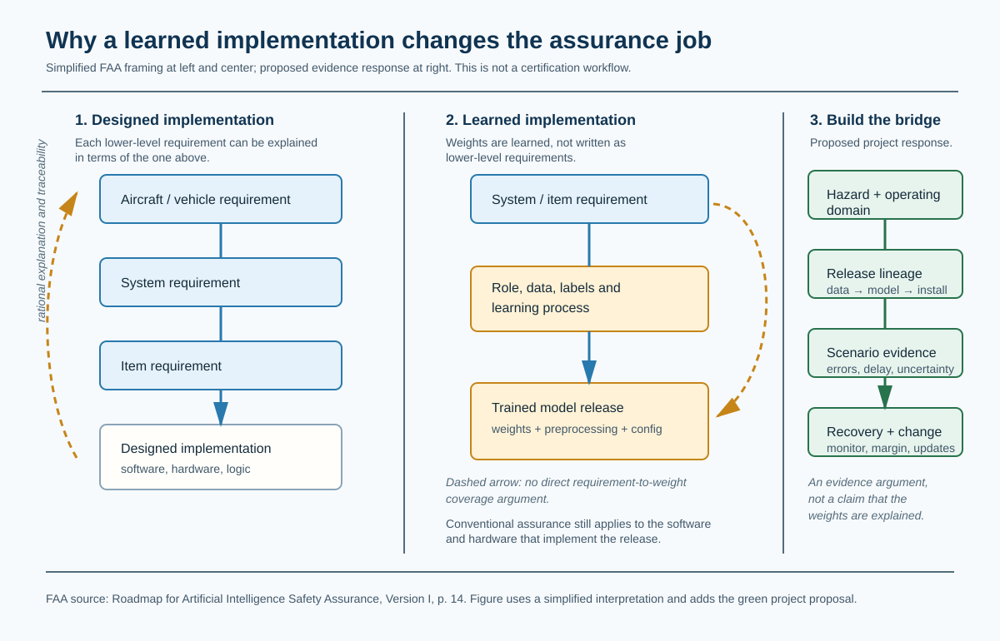
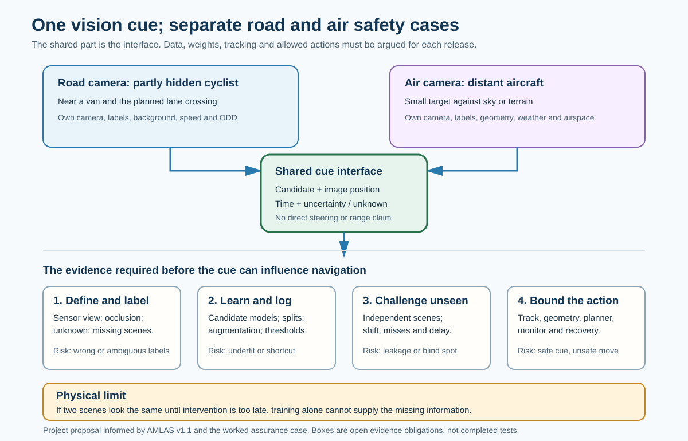
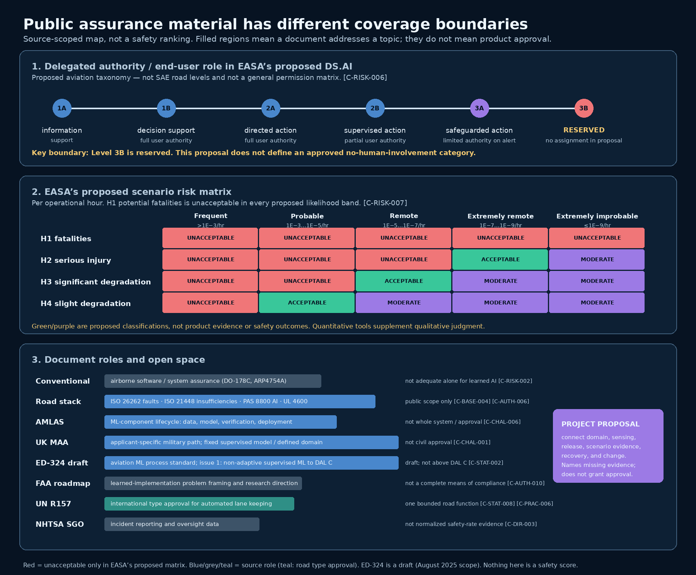
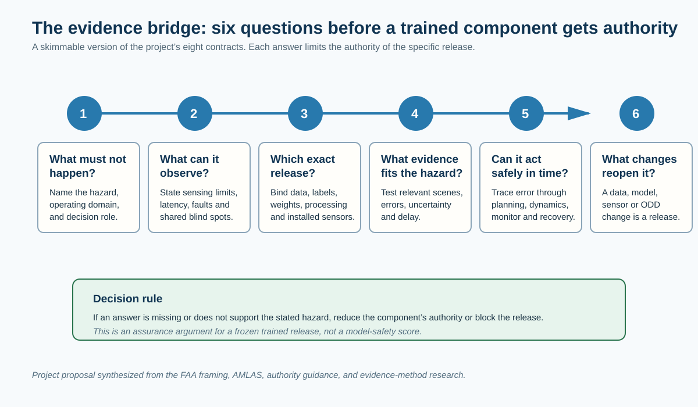

# What Would It Take to Trust a Trained Autonomous System?

## How ML assurance compares with the software playbook engineers already use, where the standards stand in 2026, and what a vision-to-control program would have to build

**Status:** reader-review draft, 25 September 2026. The worked case is a hypothetical, frozen trained component. The paper does not assess, certify, or describe the evidence of any real vehicle, aircraft, model, or company.

## The question

A car approaches a van parked at the edge of an intersection. The system's world model says the near lane is clear.

There are two possible worlds. In one, the lane really is clear. In the other, a cyclist is hidden behind the van and is about to enter the lane. If the planner and its safety monitor receive the same "clear lane" state in both worlds, they have nothing that lets them choose differently. The software can execute perfectly and still be wrong about the world.

That is the problem at the center of this paper. It comes before neural-network accuracy, formal verification, or certification vocabulary: **what lets this machine tell the dangerous world from the safe one early enough to act?**

The paper follows one small learned component through that question. A trained vision model receives a short, calibrated sequence of camera frames and returns a navigation cue: a candidate location or bearing, a time, and an uncertainty or "unknown" flag. It does not steer, estimate range from one image, or declare the path clear. Tracking, geometry, planning, a monitor, and a recovery policy turn the cue into action. Near the end the vehicle takes off, and the same cue shape is used for an airborne detect-and-avoid encounter. The road and air releases keep separate data, sensors, training, and approvals; only the interface is shared.



*Figure 1. Conventional assurance still applies to the software and hardware around the model. The gap is explaining learned behavior from lower-level requirements. The green bridge is this project's proposal.* [C-AUTH-010]

> **About the standards cited.** This paper names the standards engineers know: DO-178C, DO-330, ARP4754A, ISO 26262, ISO 21448, ISO/PAS 8800, UL 4600, and the draft ED-324/ARP6983. Most are copyrighted and paywalled, so this paper describes them only through public regulator, government, standards-body and research documents; each claim tag leads to that source.

## 1. The assurance playbook engineers already know

Safety-critical software is not assured by a single test. It is assured by a chain of work that a reviewer can walk: which function is hazardous, how much rigor it needs, what the requirements are, how the implementation traces to them, how verification shows the requirements were met, which tools touched the product, and what happens when anything changes.

**Aviation.** At the aircraft and system level, FAA Advisory Circular 20-174 recognizes ARP4754A as an acceptable method for a development-assurance process, including requirements validation and verification of the design implementation. [C-BASE-003] Rigor is scaled through development assurance levels (DALs) assigned by the system safety assessment according to the consequence of failure; the FAA's own AI roadmap uses that as its starting point. [C-RISK-002] Conventional transport-airplane guidance frames acceptability as an inverse relationship between how severe a failure condition is and how probable it may be. [C-RISK-001]

For airborne software, FAA AC 20-115D recognizes DO-178C and the DO-330 tool-qualification document as an acceptable, non-exclusive means of compliance. [C-BASE-001] NASA's public account of DO-178C describes what engineers recognize from programs: software levels A through E, with level A the most critical; extensive requirements-based and structural coverage verification at levels A and B; bidirectional traceability from requirements to code; and five tool-qualification levels for tools that generate or verify software. [C-BASE-002] [C-STAT-007] The same account states the philosophy behind it: because testing can never prove the absence of software errors, DO-178C concentrates on demonstrating the quality of the development process. [C-STAT-007]

**Road vehicles.** ISO's public description of ISO 26262 shows a functional-safety lifecycle running from management and concept through system, hardware, and software development to production and operation, with automotive safety integrity level (ASIL) analyses. [C-BASE-004] ISO 21448 (SOTIF) addresses a different problem: unreasonable risk from functional insufficiencies, including situational awareness derived from complex sensors and processing algorithms. [C-METHOD2-011]

**It took a long time to get here.** NASA's account dates DO-178B to December 1992 and DO-178C to December 2011, after seven years of committee work. [C-STAT-006] The joint SAE G-34 / EUROCAE WG-114 committee on AI in aviation formed in 2019 and published a statement of concerns in 2021. [C-STAT-001] Its first ML process standard, ED-324/ARP6983, was targeted for June 2026 in August 2025 and was listed as a draft targeting 31 December 2026 when EUROCAE's page was captured on 16 September 2026. [C-STAT-001] [C-CHAL-005] ML assurance is at its first-edition moment.

### What a learned component breaks

Most of the playbook still applies. Sensors, interfaces, the planner, control code, the build pipeline, and the operating rules need ordinary engineering. What changes is the link between intended behavior and the implementation. The team selects the task, the data, the learning process, and the frozen release, but it does not write a requirement for each learned weight. The FAA's roadmap describes exactly this break: for learned AI, the designer cannot derive lower-level requirements that directly describe the learned algorithm, or show their coverage of the requirements above them. [C-AUTH-010] The same roadmap says existing software and complex-hardware guidance is not adequate for learned implementations. [C-RISK-002]

The process philosophy also shifts. DO-178C manages the risk that people introduce errors while writing code, so assuring the process is a sensible proxy. [C-STAT-007] In a trained model, much of the behavior comes from data and optimization, so process discipline is still needed but has to be joined by evidence about the data and about performance in the encounters that matter.

| Conventional pillar | What a learned component changes | What the program needs instead |
|---|---|---|
| **Hazard and DAL/ASIL allocation.** Safety assessment sets the rigor for each function. [C-RISK-002] [C-BASE-004] | A cue can influence a maneuver without being the maneuver. | An operating domain, hazard, delegated authority, and action limit for the cue itself. |
| **Requirements traceability.** Requirements trace down to code and back. [C-BASE-002] | Behavior comes from data and training choices, not written low-level requirements. [C-AUTH-010] | Data and task requirements, a release manifest, and a trace from hazard to data, labels and interfaces. |
| **Requirements-based and structural coverage.** Tests show every requirement met and the code exercised. [C-STAT-007] | Covering a network's neurons does not show which real encounters the data left out. [C-EVID-007] | Encounter-grouped, shifted-condition, latency and "unknown" evidence. |
| **Integration testing.** Components work together on the target. | A correct cue can arrive too late for a useful action. | Closed-loop tracker, planner, dynamics, monitor and recovery traces. |
| **Configuration management.** The build that was tested is the build that flies. | Data, weights, sensor mounting, export and quantization all change the function. | Exact release identity; any material change is a new release. [C-AUTH-002] |
| **Tool qualification.** Tools that generate or verify software are qualified. [C-STAT-007] | Training, labeling, simulation and deployment tools shape the evaluated function. | A tool-influence argument and evaluation of the deployed artifact itself. |

The right-hand column is this project's proposal: a way for an engineer and a manager to ask what must exist before a trained cue may influence a hazardous action.

## 2. Start with the information problem

Return to the cyclist. Suppose the camera cannot distinguish an empty lane from a cyclist hidden behind the van until after the last moment a safe stop is possible. A larger training set cannot add pixels that were never captured. A deterministic monitor that sees only the same perception output adds no new information. [C-016]

The design then has to change one of four things: **the observation path, the speed or operating envelope, the authority delegated to the cue, or the recovery plan.** That is why a safety monitor is not a decorative box. Formal runtime-assurance results hold only when the monitor observes the relevant condition, detects it in time, switches within a bound, and hands over to a controller that can still reach a safe state. [C-EVID-005] The pattern is recognized engineering: ASTM F3269-21, an active aviation standard practice, offers run-time assurance as an alternative to design-time assurance for an unassured or complex function. [C-PRAC-001] The standard supplies an architecture; each case still has to show that its monitor can observe the failure that matters.



*Figure 2. Road and air share a small cue interface, not a model, dataset or approval. The red boundary is physical: an object that is not observable cannot be recovered by stronger training.* [C-TRAIN-001] [C-TRAIN-003]

### What the Tempe investigation shows

The National Transportation Safety Board's report on the 2018 Tempe crash, in which an Uber ATG developmental automated vehicle struck and killed a pedestrian, gives an unusually detailed public trace of a perception-to-control chain failing on a real road.

The problem was not that nothing was detected. The system first detected the pedestrian 5.6 seconds before impact. It then classified her at different times as a vehicle, an unknown object, and a bicyclist, never as a pedestrian, and never predicted her path correctly. [C-CASE-001] Each time the classification changed, the system discarded the object's tracking history, so its motion prediction started over; objects labelled "other" were not assigned goals at all. [C-CASE-002] When the system finally determined that a collision was imminent, its design suppressed braking for one second without alerting the operator, a choice made because of false-alarm concerns, and it did not permit emergency braking purely to reduce the severity of a crash. It relied on the human operator. [C-CASE-003]

NTSB found that the probable cause was the operator's failure to monitor the road because she was distracted by her phone. Uber ATG's inadequate safety risk assessment procedures, ineffective operator oversight, and inadequate safety culture were contributing factors. [C-CASE-004]

For a vision-to-control program, the lesson lies in where the failure lived. A detection existed 5.6 seconds out. It was lost between classification, tracking, prediction, the authority given to the automation, and the authority left with a person. The changes to the automated system that NTSB describes Uber ATG making afterwards were system-level: it kept the vehicle's own collision-mitigation braking active as an independent path, removed action suppression, and kept an object's track history across reclassification. [C-CASE-005] None of those is "train a more accurate classifier." They map onto the four levers above.

### Why this is also a SOTIF problem

Automotive engineers will recognize the cyclist as a SOTIF case: nothing is broken, but the intended function is insufficient for a situation it meets. ISO's public description frames SOTIF around exactly that kind of functional insufficiency in situational awareness from complex sensors and algorithms. [C-METHOD2-011] The road stack divides the work: ISO 26262 covers faults, [C-BASE-004] ISO 21448 covers functional insufficiencies, [C-METHOD2-011] ISO/PAS 8800 addresses AI elements and the trained model in road vehicles, [C-AUTH-006] and UL 4600 structures a goal-based safety case for the autonomous product. [C-AUTH-007] None of them supplies the missing evidence for a particular perception release; each tells a program where that evidence has to go. For finding hazards like the Tempe chain, where no single component failed, STPA was built for the job: it treats accidents as arising from unsafe interactions among components that may each satisfy their requirements. [C-PRAC-005]

So the useful question for the hypothetical road release is not "what is the detector's accuracy?" It is: **in this kind of encounter, with this sensing configuration and speed, does a cue arrive early enough, and survive tracking and planning intact, for the complete system to make a safe response?**

## 3. Build a program someone can run

An assurance case becomes useful when it produces recognizable artifacts and review gates. The lifecycle below is a project proposal. AMLAS, the University of York's public six-stage method, is the learned-component reference; the conventional analogues come from the public baseline in section 1. [C-CHAL-006] [C-BASE-001] [C-BASE-003]

| Phase | Artifact the team produces | Conventional analogue | Gate question |
|---|---|---|---|
| 1. Safety assessment and allocation | Hazard, operating domain, authority statement, recovery margin | System safety assessment and DAL/ASIL allocation [C-RISK-002]; STPA for interaction hazards [C-PRAC-005] | What decision may the cue influence, where, and at what criticality? |
| 2. ML requirements | Cue definition, "unknown" policy, data requirements | Software requirements | What has to be visible, and how early? |
| 3. Data management | Data manifest, label policy, encounter-grouped splits | *(no direct analogue)* | Does the data represent the claimed encounter classes? |
| 4. Model learning | Candidate log, frozen weights, training configuration | Design and implementation | What exactly is the release candidate? |
| 5. Deployment transform | Export, compiler, quantization and installed-artifact manifest | Tool qualification and target build [C-STAT-007] | Did we test the same function that will run? |
| 6. Independent evaluation | Partitioned misses, false alarms, delay and uncertainty results | Requirements-based testing with independence | Does performance support the authority limit? |
| 7. Closed-loop integration | Tracker, planner, dynamics, monitor and recovery traces | Integration and system testing | After an error, is a safe state still reachable? |
| 8. Operation and change | Change-impact record and release decision | Configuration management and change impact | Which evidence must be repeated after a change? |

The lifecycle is where the project's eight evidence obligations live: scope and authority, observability, lineage, hazard-relevant performance, closed-loop behavior, intervention and recovery, composition, and change control. The companion [technical reference](technical_reference.md) carries their IDs and the full road case.

### What two of the artifacts look like

The table can sound abstract, so here are two artifacts from phase 1 and phase 4 for the hypothetical cyclist cue. The numbers are illustrative arithmetic with stated assumptions, not measurements of any vehicle.

**A timing budget (phase 1).** Assume the car travels at 30 mph (13.4 m/s), the program allows 6 m/s² of braking, and the chain from camera frame to brake command (perception, tracking, planning, actuation) takes 0.5 s. Stopping takes v²/2a ≈ 15 m, and the latency adds 13.4 × 0.5 ≈ 6.7 m. The cue must therefore be established about **22 m, or 1.6 s, before the conflict point**. If a cyclist can first become visible 10 m ahead, as they might behind a parked van, no detector can meet that deadline at 30 mph. At 20 mph (8.9 m/s) the requirement is still about 11 m. At 15 mph (6.7 m/s) it falls to about 7 m, which fits. The operating-envelope lever turns into a written rule: *at most 15 mph within 10 m of an occluding parked vehicle, under these assumptions*. The same arithmetic tells the team what a latency improvement is worth, and what the evaluation in phase 6 has to measure: time to a usable cue, not just whether the cue eventually appears.

**A release manifest (phase 4, extended through phase 5).** A reviewer should be able to read what exactly was evaluated and what exactly will run:

```text
release:        REL-ROAD-001 (candidate)
function:       hazard cue: candidate location, time, uncertainty or "unknown"
authority:      may request deceleration; may not declare the lane clear
envelope:       ≤ 15 mph within 10 m of occluding parked vehicles (timing budget v2)
sensor:         forward camera, mount ID, calibration ID
data:           manifest hash; label policy v3 ("occluded" and "unknown" defined);
                split by encounter; verification set locked (ID, access log)
model:          architecture ID; training configuration hash; weights hash
deployment:     exporter, compiler and quantization versions;
                installed-artifact hash = evaluated-artifact hash
evidence:       partitioned evaluation report; closed-loop trace set; monitor premise
change trigger: any line above changes → new release, affected evidence rerun
```

The technical reference adds a label-policy excerpt, an evaluation-report template and a change-impact record for the same release.

### The engineering traps inside phases 3–6

A trained vision component has its own well-understood failure modes, as concrete as memory faults or priority inversion in conventional software.

| Trap | How it appears in the vision cue | Evidence the program should demand |
|---|---|---|
| **Underfitting** | Too little capacity: small or partly visible objects are missed in development and independent tests alike. | Learning curves and errors by size, occlusion and background. [C-TRAIN-004] |
| **Overfitting or shortcut learning** | Strong development scores, then failure on a new road, sky or camera; the model may key on a simulator artifact. | A logged candidate-selection history and separate capture groups. [C-TRAIN-002] |
| **Label ambiguity** | A hidden cyclist is labelled "clear" because no pixels show it. | A written label policy, adjudication record and an explicit "unknown/occluded" outcome. [C-TRAIN-001] |
| **Leakage** | Adjacent frames from one drive land on both sides of the split, or the final test set steers tuning. | Split by encounter, a locked verification set, and a record of every tuning decision. [C-TRAIN-002] [C-TRAIN-003] |
| **Wrong operating point** | A threshold improves average accuracy while missing late cues or raising unsafe false alarms. | Error costs and threshold rationale by hazard partition. [C-RISK-005] |
| **Safe cue, unsafe action** | Detection succeeds, but range, planner delay or maneuver margin fails. | Closed-loop encounter traces and recovery margin. [C-EVID-005] |

Two details matter especially to software teams. Verification sets must be independent in the ways that matter: adjacent frames from one encounter do not make a test set broader. And the evaluated network must be the deployed network. Export, compilation, quantization, preprocessing and configuration are part of the release's identity. The draft ED-324/ARP6983, as presented to the FAA in 2025, takes a similar line: once deployed, an ML model is treated as software that is either correct and qualified or not. [C-STAT-003]

AMLAS gives component-level discipline for data requirements, model learning, independent verification and deployment. It limits itself to the ML component and focuses on offline supervised learning, which is why the system phases (1, 7 and 8) have to come from elsewhere. [C-CHAL-006] [C-TRAIN-001] [C-TRAIN-003] The hypothetical case starts with a frozen, versioned release; an update is a new assurance problem, not an inherited result. [C-AUTH-002]

## 4. Where the standards landscape stands

There is no assurance vacuum. There is also no single public document that closes the complete road-to-air case. The useful question is what kind of object each document is and which part of the problem it addresses.

### Permission is not proof

The first thing an engineer should separate is permission to operate from evidence that a learned component is safe.

In the United States, a vehicle manufacturer certifies that its vehicle complies with the applicable Federal Motor Vehicle Safety Standards; the law prohibits a certificate the issuer knows, with reasonable care, to be materially false. [C-STD-003] NHTSA says it does not pre-approve new vehicles, equipment or ADS technologies. [C-STD-004] Its ADS safety framework is voluntary, and self-assessments are not federal approvals. [C-AUTH-008] Operating permission is layered on top: Texas requires authorization for commercial automated-vehicle operation, and California separates testing, driverless testing and deployment permits. [C-ROAD2-001] [C-ROAD2-006] In July 2026 NHTSA announced it had begun developing AV performance standards. [C-AUTH-009]

Other road regulators pre-approve. UN Regulation 157 on automated lane keeping systems is an international type-approval regulation, which the EU publishes as 2021/389. [C-PRAC-006] The UK is mandating compliance with it in GB type approval, notes that contracting parties are obliged to accept R157 approvals, and reviews R157-approved vehicles for listing as self-driving. [C-STAT-008] Industry has also published its own practice: Waymo describes a deployment-readiness process with acceptance criteria and safety-case evidence, and announced a TÜV SÜD audit of its safety-case program; the announcement did not include the auditor's findings. [C-ROAD2-012] [C-ROAD2-013]

Aviation separates approvals by object. A Technical Standard Order authorization approves manufacture of an article to a minimum performance standard and does not itself approve installation or use on an aircraft; TSO-C211a for detect-and-avoid equipment says installation needs separate approval. [C-AIR2-004] [C-INTAKE-003]

None of these permissions discloses the evidence behind a particular trained model. They answer different questions.

### Learned-component methods and aviation AI guidance

- **AMLAS** is a public six-stage method for assuring an ML component, explicitly limited to the component and primarily to offline supervised learning. [C-CHAL-006]
- **The UK Military Aviation Authority** has a current, applicant-specific path: an applicant raises a Military Certification Review Item (MCRI) for MAA agreement, and the notice recommends fixed supervised models in a defined operating domain for early safety-related applications. It is military guidance, not civil approval. [C-CHAL-001] [C-CHAL-002]
- **EASA** proposed detailed AI-trustworthiness specifications (DS.AI) in NPA 2025-07 in November 2025, as its response to the EU Artificial Intelligence Act; the comment period closed in March 2026, and the rulemaking page captured in September 2026 still showed the NPA awaiting responses to comments. [C-STAT-005] [C-STD-002] The proposal spans operational domain, risk assessment, development assurance, learning assurance and in-service monitoring. [C-CHAL-003] EASA's earlier CoDANN research with Daedalean proposed a W-shaped learning-assurance lifecycle and named data completeness, representativeness and robustness as challenges for safety-critical neural networks. [C-METHOD2-009]
- **ED-324/ARP6983** is the joint SAE/EUROCAE process standard. EUROCAE opened a public consultation on the draft in August 2025. [C-STAT-004] As presented to the FAA that month, issue 1 is limited to non-adaptive, supervised ML up to DAL C, with information security and human factors out of scope; the draft cannot be used if the safety assessment places the function above DAL C. [C-STAT-002]
- **The FAA** stated in its 2024 roadmap that the industry lacked a method for AI safety assurance, and described project-specific issue papers as one way to proceed; it reports working with industry, standards bodies and academia. [C-AUTH-001] [C-AUTH-003] [C-STD-001]

EASA's proposal also makes its boundaries explicit. Levels 1A through 3A assign defined forms of end-user authority; Level 3B, the top of the scale, is reserved with no assignment. [C-RISK-006] Its risk matrix, expressed per operational hour, classifies every scenario with potential fatalities (H1) as unacceptable at every likelihood, including extremely improbable. [C-RISK-007] The proposal does not cover AI whose risk directly contributes to fatalities. [C-CHAL-004]



*Figure 3. A coverage map, not a ranking: what each document addresses and leaves open. EASA's material is proposed, Level 3B is reserved, and ED-324 is a draft.* [C-RISK-006] [C-RISK-007] [C-RISK-002] [C-BASE-004] [C-AUTH-006] [C-CHAL-001] [C-CHAL-006] [C-STAT-002] [C-AUTH-010] [C-STAT-008] [C-PRAC-006] [C-DIR-003]

## 5. What the authorities have yet to do

The status items above add up to a concrete list. The table is dated; each row should be rechecked before relying on it. The "consequence" column is this project's reading of what the status means for a program today.

| Open item (as of 25 Sept 2026) | Who | Public status | Consequence for a program today |
|---|---|---|---|
| Publish an aviation ML process standard | SAE G-34 / EUROCAE WG-114 | ED-324/ARP6983 is a draft; target slipped from June to 31 December 2026 [C-STAT-001] [C-CHAL-005] | Work from the draft, AMLAS and EASA material through the certification basis. |
| Cover ML above DAL C | Standards bodies and authorities | Issue 1 as presented stops at DAL C [C-STAT-002] | A high-criticality function has no ML process standard; architecture must keep the learned part at lower criticality or negotiate case by case. |
| Define an FAA acceptance means | FAA | Roadmap says the industry lacks a method; project-specific issue papers [C-AUTH-001] [C-AUTH-003] | Expect a program-specific certification basis. |
| Finalize EU AI specifications | EASA | DS.AI proposed; awaiting responses to comments [C-STD-002] [C-STAT-005] | Candidate objectives, not final means of compliance. |
| Allow the most autonomous and highest-consequence roles | EASA | Level 3B reserved; H1 unacceptable at every likelihood [C-RISK-006] [C-RISK-007] | No proposed EU path for AI directly contributing to fatalities. [C-CHAL-004] |
| Assure learning during operation | All | Frameworks focus on offline, supervised, or non-adaptive learning [C-CHAL-006] [C-STAT-002]; FAA says operational learning needs its own strategy [C-AIR2-007] | Freeze releases; treat every update as a new release. |
| Cover other ML techniques such as reinforcement learning | SAE G-34 / EUROCAE WG-114 | Planned for a later issue 2 [C-STAT-003] | Out of scope for the first standard. |
| Assure the compute hardware | Standards bodies and authorities | Conventional hardware guidance exists: DO-254 via AC 20-152A, and multi-core interference via AC 20-193, which excepts cores acting only as co-processors or graphics processors in some configurations [C-PRAC-002] [C-PRAC-003]. Draft ED-324 treats graphics processors as random hardware [C-STAT-003]; FAA says existing complex-hardware guidance is inadequate for learned AI [C-RISK-002] | Argue hardware assurance per program and per configuration. |
| Set US performance standards for automated driving | NHTSA | Development initiated July 2026 [C-AUTH-009]; no pre-approval [C-STD-004] | Learned-perception evidence stays with the manufacturer; public comparison depends on voluntary disclosure. |
| Turn road AI practice into requirements | ISO, SAE | ISO/PAS 8800 published [C-AUTH-006]; SAE J3321 is an information report with no mandatory requirements [C-STD-005] | Shared vocabulary and methods; acceptance criteria remain program-specific. |
| Connect perception error rates to hazard likelihood | Open | Severity/likelihood frameworks exist [C-RISK-001] [C-RISK-007]; within the inspected public material we did not find a published method that converts perception error rates into those likelihood bands | Each program must build and defend this link itself. |

### The architecture tension

There is a harder question behind the table. The public frameworks are built around modular, frozen, supervised components: the MAA recommends fixed supervised models for early applications, [C-CHAL-001] AMLAS focuses on offline supervised learning, [C-CHAL-006] and ED-324 issue 1, as presented, covers non-adaptive supervised ML. [C-STAT-002] Some developers are moving the other way. Wayve describes replacing the modular "sense-plan-act" architecture with a single neural network trained to turn raw sensor inputs into driving outputs; [C-CASE-008] Tesla describes camera-based neural-network outputs, world representations and trajectory planning. [C-ROAD2-010]

This paper's evidence bridge attaches evidence at interfaces: the cue, the track, the plan, the monitor. An end-to-end design removes most of those places. It is not unassurable by definition, but it has to supply the same evidence another way, for example through an independent observation and intervention path whose premises can be checked on their own. [C-METHOD2-019] [C-EVID-005] For managers, the practical point is that **architecture choice determines assurability**, and the architecture that can be assured today may not be the one a program would otherwise choose.

## 6. What each method can contribute

Methods are valuable when they answer a particular question in the lifecycle.

| Method | Good use | Boundary |
|---|---|---|
| Scenario taxonomy and combinatorial coverage | Shows which selected encounter factors were exercised. | It cannot reveal a causal factor the taxonomy omitted. [C-EVID-002] |
| Rare-event simulation | Estimates a stated event under a stated generator, simulator and threshold. | It does not automatically transfer to a changed sensor or tail distribution. [C-EVID-003] The simulator's own credibility needs assessing; NASA-STD-7009B is one public model of that practice. [C-PRAC-004] |
| Calibration | Connects uncertainty to an authority restriction on an evaluated partition. | It does not establish calibration after a shift. [C-EVID-004] |
| Formal verification of network properties | Proves stated input-output properties of a specific network. | Open-loop properties do not establish closed-loop safety (see section 7). [C-CASE-006] [C-CASE-007] |
| Runtime monitoring | Supports a conditional switch to recovery; ASTM F3269-21 gives an aviation architecture practice. [C-PRAC-001] | It cannot rescue an unobservable or too-late failure. [C-EVID-005] |
| Interpretability and neuron coverage | Challenge a story and suggest new tests. | Neither is a causal proof of safe behavior. [C-EVID-006] [C-EVID-007] |

An average can also hide the case that matters. The UK Civil Aviation Authority's detect-and-avoid material notes that averaging risk-ratio metrics can conceal deficiencies in particular encounters. [C-RISK-004] Each method can strengthen one edge of an argument; none should be promoted into the whole argument.



*Figure 4. The evidence bridge groups the lifecycle questions above. It is a project proposal, not an authority checklist or a safety score.*

## 7. Let the vehicle take off

Keep the cue shape and change the world. A non-cooperative glider appears as a small dark cluster against broken terrain. The camera can flag a possible bearing, but the aircraft cannot safely turn on a pixel cluster: it needs a usable track, range and range rate, traffic context, maneuver clearance, and enough separation margin to act. The airborne release has its own training data, sensor configuration and frozen identity.

| Same assurance question | Road | Air |
|---|---|---|
| What must become observable? | A road actor and its likely conflict with the route. | An aircraft, a usable track, and enough information for separation. |
| What is the last useful action? | Braking, steering or a controlled minimum-risk response. | Alerting or maneuvering while keeping traffic and terrain clearance. |
| What is a dangerous shortcut? | Treating late detection as safe detection. | Treating a bearing-only cue, or a later landing, as an escape. |
| Who gives permission? | Manufacturer self-certification in the US; type approval under UN R157 for automated lane keeping. [C-STD-004] [C-STAT-008] | Separate equipment, installation, aircraft and operational approvals. [C-INTAKE-003] |
| How is rigor set? | ASIL analysis in the functional-safety lifecycle. [C-BASE-004] | DAL from the system safety assessment. [C-RISK-002] |

The last row matters for learned components. Whether an airborne function falls above DAL C depends on its failure-condition classification, which this hypothetical case has not made. If it does, ED-324 issue 1, as presented, would not apply to it. [C-STAT-002] EASA's proposal would not cover it either if its AI directly contributes to potential fatalities. [C-CHAL-004]

### The collision-avoidance network that was verified and still unsafe

Aviation already has a cautionary example. ACAS Xu is a collision-avoidance system for unmanned aircraft. Its designers produced a very large decision table, and researchers compressed that table by a factor of about 1,000 into a set of neural networks. [C-CASE-007] Verification researchers then proved properties of those prototype networks, at a scale an order of magnitude beyond earlier tools. [C-CASE-006]

Those were open-loop properties: statements about what the network outputs for given inputs. Collision avoidance is a closed-loop property: what happens after the aircraft follows the advice, the geometry changes, and the network is asked again. When Bak and Tran analyzed the closed loop, even under favorable assumptions (perfect sensor information, advisories followed instantly, ideal maneuvers, an intruder flying straight), they found cases where the early prototype system still collided. [C-CASE-007]

That is the paper's argument in one aviation example. Proving something about the component is valuable. It is not the same as showing that the system, in closed loop, keeps aircraft apart.

The road result cannot authorize flight, and the air case needs its own data, release, tracking, action authority and evidence. The value of the comparison is that it forces every assumption road intuition hides into view.

## 8. What a team should do next

A team does not need to wait for a finished standard to do disciplined work. It can begin with a bounded function and make the argument inspectable.

1. **Pick one hazardous decision and write the authority limit before choosing a model.** Find out what DAL or ASIL the function will carry; if an aviation function lands above DAL C, plan for ED-324 issue 1 not to cover it. [C-STAT-002]
2. **State which world difference must be observed, by which path, before the last recoverable action.** If the answer is "the same camera the model uses," the monitor shares its blind spot.
3. **Freeze the release identity:** data, labels, training choices, weights, preprocessing, deployment transform, sensors and downstream interfaces.
4. **Evaluate the deployed artifact** by encounter group, error delay, uncertainty and closed-loop recovery, not an aggregate score.
5. **Give an independent reviewer permission to challenge** the sensor path, the data split, the simulator, the monitor premise and the change record.
6. **Treat a material change as a new release** until the affected evidence has been repeated.
7. **Bring the authority in early** for the certification basis and function allocation; in aviation today that is program-specific. [C-AUTH-003]

The four levers are the real conclusion: improve the observation path, narrow the speed and operating envelope, reduce the authority delegated to the learned component, or provide a recovery action that remains useful in time. A release earns more authority only when the evidence supports those levers together.

The question to keep is the opening one: **what exactly lets this machine take this action, here, now, and what evidence would prove us wrong?**

## Continue in the technical reference

This paper is written for the first read. The [technical reference](technical_reference.md) holds the detailed argument: the eight evidence contracts with their IDs, the complete road assurance argument, risk and probability, method limits, the project's verification process, and the source list.

## Appendix A. What this draft does and does not claim

This is a proposed architecture for a hypothetical, frozen trained component. It does not determine whether any named vehicle, aircraft, detect-and-avoid product or model meets a regulatory standard, infer proprietary evidence from a deployment, or provide legal or certification advice. The Tempe and ACAS Xu examples are used for the specific findings their sources report. Status items are dated and must be rechecked before publication.

## Appendix B. Primary reading links

- [FAA Roadmap for AI Safety Assurance](https://www.faa.gov/aircraft/air_cert/step/roadmap_for_AI_safety_assurance): learned-implementation framing and frozen-versus-learning distinction. `[C-AUTH-002] [C-AUTH-010]`
- [FAA AC 20-115D](https://www.faa.gov/documentLibrary/media/Advisory_Circular/AC_20-115D.pdf) and [AC 20-174](https://www.faa.gov/documentLibrary/media/Advisory_Circular/AC_20-174.pdf): recognition of DO-178C/DO-330 and ARP4754A. `[C-BASE-001] [C-BASE-003]`
- [NASA: Certification of Safety-Critical Software Under DO-178C and DO-278A](https://ntrs.nasa.gov/citations/20120016835): public account of levels, coverage, traceability and tool qualification. `[C-BASE-002] [C-STAT-006] [C-STAT-007]`
- [AMLAS v1.1, University of York](https://www.york.ac.uk/media/assuring-autonomy/documents/AMLASv1.1.pdf): learned-component lifecycle. `[C-CHAL-006]`
- [EASA NPA 2025-07](https://www.easa.europa.eu/en/document-library/notices-of-proposed-amendment/npa-2025-07): proposed DS.AI and scope. `[C-STAT-005] [C-CHAL-003] [C-CHAL-004]`
- [ED-324/ARP6983 presentation, FAA AI/ML Technical Exchange, August 2025](https://na.eventscloud.com/file_uploads/115fca49330a77ce92d7fe04e9874faf_Day1-Jahn-202508ED-324ARP6983presFAAAI-MLTechExchangeMeeting_8-5-25-Read-Only.pdf): draft scope and schedule. `[C-STAT-001] [C-STAT-002] [C-STAT-003]`
- [NTSB HAR-19/03, Tempe](https://www.ntsb.gov/investigations/AccidentReports/Reports/HAR1903.pdf): detection, classification, prediction and braking design findings. `[C-CASE-001] [C-CASE-002] [C-CASE-003] [C-CASE-004] [C-CASE-005]`
- [Katz et al., Reluplex](https://arxiv.org/abs/1702.01135) and [Bak & Tran, ACAS Xu closed-loop analysis](https://arxiv.org/abs/2201.06626). `[C-CASE-006] [C-CASE-007]`
- [ASTM F3269-21 (public scope page)](https://www.astm.org/f3269-21.html): run-time assurance standard practice. `[C-PRAC-001]`
- [FAA AC 20-152A](https://www.faa.gov/documentLibrary/media/Advisory_Circular/AC_20-152A.pdf) and [AC 20-193](https://www.faa.gov/documentLibrary/media/Advisory_Circular/AC_20-193.pdf): DO-254 recognition and multi-core processors. `[C-PRAC-002] [C-PRAC-003]`
- [NASA-STD-7009B](https://standards.nasa.gov/standard/NASA/NASA-STD-7009): models and simulations credibility. `[C-PRAC-004]`
- [STPA Handbook, Leveson and Thomas](https://psas.scripts.mit.edu/home/get_file.php?name=STPA_handbook.pdf). `[C-PRAC-005]`
- [UK DfT: UN Regulation 157 in GB type approval](https://www.gov.uk/government/consultations/incorporating-international-rules-into-gb-type-approval-for-road-vehicles/outcome/incorporating-international-rules-into-gb-type-approval-for-road-vehicles-outcome). `[C-STAT-008]`
