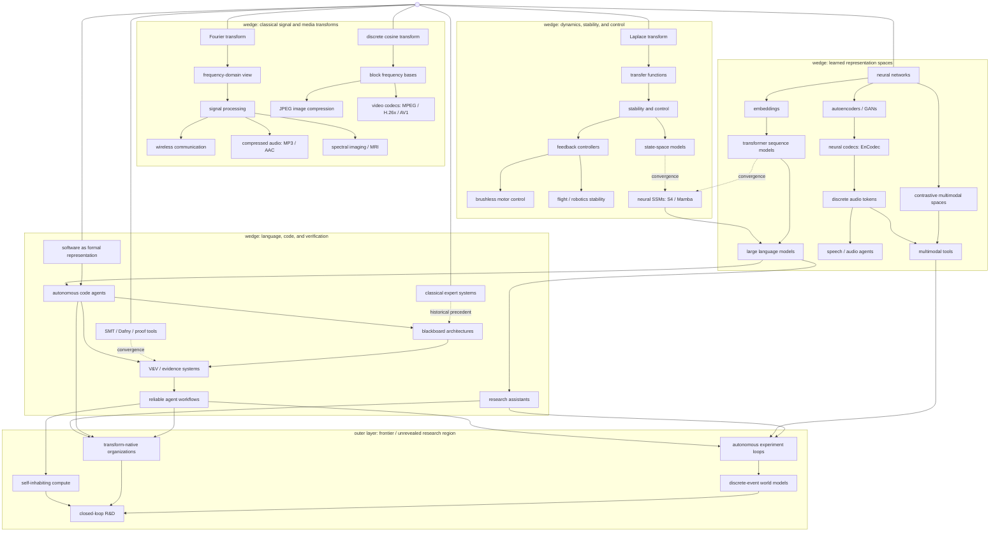

# Tech Tree Lineage Review

Use this file to comment on what belongs in the public-facing tree. The goal is not to prove every historical influence. The goal is to decide which relationships are useful, defensible, and visually worth showing.

Suggested comment tags:

- `KEEP`: belongs in the diagram.
- `CUT`: too detailed, distracting, or not part of this argument.
- `RENAME`: good idea, wrong label.
- `MOVE`: node belongs, but the parent/edge is wrong.
- `TOO-DEEP`: true enough, but too technical for this video.
- `NEEDS-SOURCE`: keep only if we can support it cleanly.

## Visual Premise

This version treats the tech tree like a radial skill tree. The center is only a visual origin, not a technology or claim. Each category becomes a wedge whose size can change with its contents. The frontier is an outer layer or fog-of-war region, not a normal category wedge.

The current wedges are:

- Classical signal and media transforms.
- Dynamics, stability, and control.
- Learned representation spaces.
- Language, code, and verification.
- Outer frontier / unrevealed research region.

## Review Diagram

## Main Questions

- Should Fourier, Laplace, and DCT each get their own visible branch, or should one or more collapse into a shared "classical transforms" wedge for the video?
- Is "brushless motor control" vivid enough as the Laplace/control payoff, or should this become flight control, robotics, or power electronics more broadly?
- Should `neural SSMs: S4 / Mamba` be a visible cross-category convergence, or a brief article-only side note?
- Should the software wedge include V&V/evidence systems, or does that pull too hard toward the verifiability compiler project?
- Should `classical expert systems` and `blackboard architectures` remain as historical precedent for agent workflows?
- Should the frontier layer be shown as an outer fog-of-war ring, a higher 3D shell, or a final zoom-out beyond the main tree?

## Node Review

| Node | Tag | Comment |
| --- | --- | --- |
| Fourier transform |  |  |
| frequency-domain view |  |  |
| signal processing |  |  |
| wireless communication |  |  |
| compressed audio: MP3 / AAC |  |  |
| spectral imaging / MRI |  |  |
| discrete cosine transform |  |  |
| block frequency bases |  |  |
| JPEG image compression |  |  |
| video codecs: MPEG / H.26x / AV1 |  |  |
| Laplace transform |  |  |
| transfer functions |  |  |
| stability and control |  |  |
| feedback controllers |  |  |
| brushless motor control |  |  |
| flight / robotics stability |  |  |
| state-space models |  |  |
| neural SSMs: S4 / Mamba |  |  |
| neural networks |  |  |
| embeddings |  |  |
| transformer sequence models |  |  |
| large language models |  |  |
| contrastive multimodal spaces |  |  |
| autoencoders / GANs |  |  |
| neural codecs: EnCodec |  |  |
| discrete audio tokens |  |  |
| speech / audio agents |  |  |
| multimodal tools |  |  |
| software as formal representation |  |  |
| autonomous code agents |  |  |
| research assistants |  |  |
| classical expert systems |  |  |
| blackboard architectures |  |  |
| SMT / Dafny / proof tools |  |  |
| V&V / evidence systems |  |  |
| reliable agent workflows |  |  |
| transform-native organizations |  |  |
| self-inhabiting compute |  |  |
| autonomous experiment loops |  |  |
| discrete-event world models |  |  |
| closed-loop R&D |  |  |

## Edge Review

| Edge | Tag | Comment |
| --- | --- | --- |
| Fourier -> frequency-domain view -> signal processing |  |  |
| signal processing -> wireless communication |  |  |
| signal processing -> compressed audio |  |  |
| signal processing -> spectral imaging / MRI |  |  |
| DCT -> block frequency bases -> JPEG / video codecs |  |  |
| Laplace -> transfer functions -> stability and control |  |  |
| stability/control -> feedback controllers -> motor control / flight robotics |  |  |
| stability/control -> state-space models -> neural SSMs |  |  |
| neural networks -> embeddings -> transformers -> LLMs |  |  |
| neural networks -> contrastive multimodal spaces -> multimodal tools |  |  |
| neural networks -> autoencoders/GANs -> neural codecs -> audio tokens -> speech agents |  |  |
| transformer sequence models -> neural SSMs |  |  |
| neural SSMs -> LLMs |  |  |
| LLMs -> code agents / research assistants |  |  |
| code agents + formal verifiers + blackboard architectures -> V&V systems |  |  |
| V&V systems -> reliable agent workflows |  |  |
| reliable workflows / code agents / research assistants -> frontier layer |  |  |
| reliable workflows + multimodal tools + research assistants -> autonomous experiment loops |  |  |
| autonomous experiment loops -> discrete-event world models -> closed-loop R&D |  |  |
