# Transform Technology Tree

## Draft Tree

```mermaid
flowchart TD
  A[Representation Transforms] --> B[Fourier / Frequency Domain]
  A --> C[Laplace / Transfer Function Domain]
  A --> D[Discrete Cosine / Compression Domains]
  A --> E[Linear Algebra / Eigenvector Domains]
  A --> F[Information-Theoretic Codes]
  A --> G[Learned Vector Representations]

  B --> B1[Radio and Telecommunications]
  B --> B2[Audio Filtering and Synthesis]
  B --> B3[Optics and Diffraction]
  B --> B4[MRI and Spectral Imaging]
  B --> B5[PDE and Spectral Methods]

  C --> C1[Control Theory]
  C --> C2[Circuit Analysis]
  C --> C3[Aircraft and Robotics Stability]
  C --> C4[Industrial Process Control]

  D --> D1[JPEG Compression]
  D --> D2[Video Compression]
  D --> D3[Bandwidth-Efficient Media]

  E --> E1[PCA and Dimensionality Reduction]
  E --> E2[Search Ranking]
  E --> E3[Recommendation Systems]
  E --> E4[Modal Analysis]

  F --> F1[Data Compression]
  F --> F2[Error-Correcting Codes]
  F --> F3[Reliable Digital Communication]

  G --> G1[Embeddings and Semantic Search]
  G --> G2[Machine Translation]
  G --> G3[Text-to-Code]
  G --> G4[Text-to-Image and Multimodal Generation]
  G --> G5[Agents and Tool Use]
  G --> G6[Verifiability Compiler]
```

## Transform Breakthroughs to Consider

- **Fourier transform:** makes signals understandable by frequency content.
- **Laplace transform:** makes dynamic systems easier to analyze using algebraic transfer functions.
- **z-transform:** makes sampled digital systems analyzable in a discrete-time domain.
- **Discrete cosine transform:** powers practical lossy image and video compression.
- **Wavelet transforms:** support localized time-frequency analysis, compression, denoising, and multiresolution image processing.
- **Eigenvector decompositions:** reveal principal directions, modes, rankings, and lower-dimensional structure.
- **Information theory and coding transforms:** make communication robust, compressible, and measurable.
- **Backpropagation over differentiable programs:** turns model design into trainable parameter spaces.
- **Embeddings and attention-based transformers:** turn symbols and perceptual fragments into context-sensitive learned vector representations.

## Open Design Question

The tree can be rendered as either:

- a historical technology tree, showing earlier transform breakthroughs leading to modern AI;
- a conceptual tree, showing different kinds of representation spaces;
- a safety argument tree, showing why each transform needs assumptions, error models, and verification practices.

